# Valuing Wide Receivers Beyond ADP
### A pre-registered empirical-Bayes pipeline: derivations, models, tests, results — 2026 preseason

*One continuous document: every model and test with its notation, derivation, and the intuition
for why it's built that way, followed by every number the pipeline produced and the final 2026
board. Figures in `results/figures/`; rerunnable code in `scripts/01–12`; per-step lab notes in
`results/section*_notes.md`. Executed and verified 2026-07-13/14.*

---

## 0. The idea in one paragraph

ADP (average draft position) is a market price: the pooled judgment of thousands of drafters.
Beating it outright is hard, so we don't start by trying. Instead we treat **ADP as a prior**,
treat each player's **own game history as data**, and combine them the way Bayes says to —
weighting each by how much it actually knows. Every weight in that combination is *estimated
from data*, never hand-set: how noisy a WR game is (§2), whether that noise differs by
experience (§3), how much history a player effectively has (§1), what an ADP slot has
historically been worth and how wide the outcomes around it spread (§6.1). Then, and only
then, we test whether anything else — age, team changes, usage stats — predicts the market's
*errors* (§6.2), under multiple-testing discipline. The whole thing is validated
leave-one-season-out against the market itself (§7). Governing rules, fixed before any fit:
no tuning toward expected results, no named players anywhere in the pipeline, surprises are
findings, and any claim of edge must survive both FDR control and a temporal holdout.

## 1. Notation (used everywhere)

| symbol | meaning |
|---|---|
| i = 1..N | player (N = 30 on the 2026 board; larger samples where noted) |
| s = 1..n_i | season within player i's career |
| g = 1..G_is | game within season s |
| Y_isg | PPR points for player i, season s, game g |
| Ȳ_is = (1/G_is)Σ_g Y_isg | season-mean points per game (PPG) |
| Ȳ_i· = (1/n_i)Σ_s Ȳ_is | career mean of season means |
| e_is ∈ {0, 1, 2+} | years of NFL experience entering season s (rookie / soph / vet) |
| t(i,s) | team of player i in season s |
| ADP_i | preseason average draft position |
| θ_i | player i's *true* (unobservable) next-season PPG — the estimand |

All analysis is per-game (17-game seasons from 2021, 16 before — totals are never compared
across eras). PPR scoring: 1/reception, 0.1/yard, 6/TD.

## 2. Data

- **ADP** — FantasyFootballCalculator API, PPR, 12-team: the current 2026 board (1,737 real
  drafts, July 6–13 2026) and historical boards 2015–2024 (the API has no 2025 data; nothing
  was imputed). Modeling universe: top 30 WRs by 2026 ADP.
- **Game logs** — nflverse weekly player stats, all players, 2014–2025 (targets, receptions,
  yards, TDs, air yards, YAC, target share, WOPR, RACR, EPA, `fantasy_points_ppr`). The 30
  board WRs contribute 2,151 career game rows (Adams/Evans back to their 2014 rookie years —
  verified; no career predates the window).
- **Team-week stats** — nflverse, all 32 teams, 2014–2025 (pass attempts, passing EPA, …).
- **Metadata** — birth date, rookie season, draft capital; joined on `gsis_id` everywhere,
  30/30 matched.

**Game-inclusion rule (§0, pre-specified from aggregate distributions only):** regular season;
drop player-games with **targets ≤ 1** (1.9% of rows; mean 1.9 PPR points, target share 0.038
vs population median 0.24 — a non-participation mixture of injured-early/decoy games). 2,033
rows → 39 excluded. Consequence stated up front: all rates are *given participation*;
missed-game risk is a separate question (it returns in §6.2).

---

## 3. §1 — Consistency: separating per-game noise from per-year movement

**Intuition.** "Is this player consistent?" conflates two different things: does he swing game
to game (a floor/ceiling question), and does his *level* move year to year (a role/health/aging
question)? Worse, the second is contaminated by the first: a season mean built on few games is
itself noisy, so an injury-shortened season *looks* like year-to-year volatility even when the
player's true level never moved. We model the two levels explicitly and remove the
contamination in closed form.

**Model** (per player; index i suppressed):

    season level:  θ_s = μ + δ_s        E[δ_s] = 0,  Var(δ_s) = τ²_B   ("per-year" movement)
    game level:    Y_sg = θ_s + ε_sg    E[ε_sg] = 0, Var(ε_sg) = σ²_W  ("per-game" scatter)

with δ ⟂ ε, ε iid within season.

**Derivation of the bias, and the fix.** You never observe θ_s — only

    Ȳ_s = θ_s + ε̄_s,   Var(ε̄_s) = σ²_W/G_s   ⟹   Var(Ȳ_s) = τ²_B + σ²_W/G_s        (1)

The naive year-to-year volatility estimate is v = (1/(n−1))Σ_s(Ȳ_s − Ȳ·)². Using
E[Σ(Ȳ_s − Ȳ·)²] = Σ_s Var(Ȳ_s) − n·Var(Ȳ·) with Var(Ȳ·) = (1/n²)Σ_s Var(Ȳ_s):

    E[v] = (1/n) Σ_s Var(Ȳ_s) = τ²_B + (σ²_W/n) Σ_s (1/G_s)                          (2)

So v overstates true between-season variance by an averaging-noise term that explodes when
G_s is small — the precise sense in which short seasons masquerade as inconsistency. σ²_W is
estimable unbiasedly from within-season scatter (df-weighted pool of season sample variances),
so invert (2):

    τ̂²_B = max{ 0,  v − σ̂²_W · (1/n) Σ_s (1/G_s) }                                   (3)

Magnitude: for a typical σ_W ≈ 7 PPG, a 17-game season adds 2.9 PPG² of pure noise to
Var(Ȳ_s); an 8-game season adds 6.1. Reported only for n ≥ 4 (v itself has SD ≈
√(2/(n−1))·E[v]).

**Other §1 estimators.** Recency-weighted level with half-life h = 1 season:
μ̂ = Σ w_s Ȳ_s / Σ w_s, w_s = 2^(−(S−s)/h); its effective sample size n_eff = (Σw)²/Σw²
is the data-precision input the shrinkage needs later. Boom P(Y>20) / bust P(Y<8) rates are
stabilized by empirical Bayes: k_i | p_i ~ Bin(m_i, p_i), p_i ~ Beta(α, β) across players;
by total variance Var(p̂_i) = Var(p_i) + E[p(1−p)/m_i], so the observed spread of raw rates
minus average binomial noise identifies (α, β) by moments; report (k_i+α)/(m_i+α+β).
Fitted: boom (α, β) = (6.11, 20.20), bust (4.31, 13.23).

**Results** (headline, h = 1, exclusions on; full sensitivity columns in
`results/consistency_table.csv`):

| WR | n_seas | games | μ̂ | n_eff | σ̂_W | naive v | τ̂²_B untr. | τ̂_B | CV | q25 | q90 | boom | bust |
|---|---|---|---|---|---|---|---|---|---|---|---|---|---|
| Puka Nacua | 3 | 44 | 21.27 | 2.33 | 9.68 | 9.62 | 2.99 | n<4 | .46 | 13.9 | 32.5 | .39 | .17 |
| Ja'Marr Chase | 5 | 78 | 20.23 | 2.82 | 11.74 | 7.54 | −1.44 | 0.0 | .58 | 10.9 | 33.3 | .37 | .15 |
| Amon-Ra St. Brown | 5 | 79 | 19.55 | 2.82 | 9.12 | 5.03 | −0.24 | 0.0 | .47 | 12.6 | 30.4 | .35 | .14 |
| Rashee Rice | 3 | 27 | 18.80 | 2.33 | 6.63 | 18.01 | 10.38 | n<4 | .35 | 10.4 | 25.0 | .25 | .16 |
| CeeDee Lamb | 6 | 93 | 17.72 | 2.91 | 8.44 | 12.62 | 7.96 | 2.82 | .48 | 10.6 | 28.5 | .28 | .11 |
| Jaxon Smith-Njigba | 3 | 51 | 17.61 | 2.33 | 7.09 | 38.19 | 35.23 | n<4 | .40 | 7.6 | 26.3 | .26 | .25 |
| Davante Adams | 12 | 175 | 16.81 | 3.00 | 9.13 | 28.24 | 22.47 | 4.74 | .54 | 9.3 | 31.0 | .33 | .19 |
| A.J. Brown | 7 | 103 | 16.28 | 2.95 | 9.14 | 3.43 | −2.31 | 0.0 | .56 | 9.3 | 27.9 | .30 | .20 |
| Drake London | 4 | 60 | 15.66 | 2.65 | 8.43 | 9.57 | 4.74 | 2.18 | .54 | 7.4 | 24.6 | .18 | .27 |
| Justin Jefferson | 6 | 94 | 15.60 | 2.91 | 9.21 | 11.88 | 6.26 | 2.50 | .59 | 11.0 | 31.2 | .36 | .19 |
| Malik Nabers | 2 | 19 | 15.60 | 1.80 | 9.91 | 7.86 | −7.70 | n<4 | .64 | 11.9 | 30.2 | .27 | .17 |
| Nico Collins | 5 | 63 | 15.53 | 2.82 | 7.03 | 26.25 | 22.25 | 4.72 | .45 | 8.5 | 24.1 | .21 | .24 |
| Chris Olave | 4 | 53 | 15.07 | 2.65 | 6.52 | 3.50 | −0.32 | 0.0 | .43 | 10.2 | 21.4 | .20 | .15 |
| Tee Higgins | 6 | 81 | 15.04 | 2.91 | 8.82 | 5.55 | −0.25 | 0.0 | .59 | 9.2 | 26.8 | .23 | .24 |
| George Pickens | 4 | 64 | 14.68 | 2.65 | 8.00 | 9.75 | 5.72 | 2.39 | .54 | 7.2 | 25.0 | .19 | .30 |
| Garrett Wilson | 4 | 58 | 14.05 | 2.65 | 7.51 | 1.27 | −3.24 | 0.0 | .53 | 8.1 | 24.3 | .19 | .24 |
| Zay Flowers | 3 | 48 | 13.79 | 2.33 | 7.22 | 0.54 | −2.73 | n<4 | .52 | 9.7 | 22.3 | .20 | .20 |
| Mike Evans | 12 | 175 | 13.66 | 3.00 | 9.37 | 5.37 | −0.87 | 0.0 | .69 | 9.3 | 29.2 | .28 | .17 |
| DeVonta Smith | 5 | 80 | 13.25 | 2.82 | 7.81 | 3.94 | 0.09 | 0.30 | .59 | 7.0 | 22.9 | .20 | .29 |
| DK Metcalf | 7 | 111 | 12.93 | 2.95 | 7.36 | 2.53 | −0.89 | 0.0 | .57 | 8.5 | 22.7 | .18 | .23 |
| Terry McLaurin | 7 | 107 | 12.82 | 2.95 | 6.96 | 2.44 | −0.83 | 0.0 | .54 | 8.3 | 23.7 | .20 | .22 |
| Jameson Williams | 4 | 43 | 12.65 | 2.65 | 7.31 | 18.83 | 9.16 | 3.03 | .58 | 6.0 | 24.3 | .19 | .30 |
| Ladd McConkey | 2 | 32 | 12.56 | 1.80 | 7.03 | 7.03 | 3.94 | n<4 | .56 | 7.9 | 20.8 | .21 | .25 |
| Tetairoa McMillan | 1 | 17 | 12.55 | 1.00 | 7.07 | — | — | n<4 | .56 | 8.6 | 18.5 | .16 | .24 |
| Jaylen Waddle | 5 | 77 | 12.54 | 2.82 | 7.70 | 5.06 | 1.20 | 1.10 | .61 | 7.8 | 25.1 | .19 | .26 |
| Christian Watson | 4 | 42 | 11.95 | 2.65 | 7.86 | 3.65 | −2.30 | 0.0 | .66 | 6.2 | 22.2 | .22 | .32 |
| Emeka Egbuka | 1 | 17 | 11.51 | 1.00 | 8.42 | — | — | n<4 | .73 | 5.0 | 23.5 | .23 | .33 |
| Rome Odunze | 2 | 29 | 10.96 | 1.80 | 7.55 | 6.67 | 2.61 | n<4 | .69 | 5.1 | 20.3 | .18 | .39 |
| Alec Pierce | 4 | 61 | 10.75 | 2.65 | 6.91 | 11.32 | 8.18 | 2.86 | .64 | 3.5 | 18.6 | .13 | .50 |
| Luther Burden III | 1 | 13 | 9.72 | 1.00 | 7.41 | — | — | n<4 | .76 | 5.7 | 18.7 | .18 | .34 |

**Findings.**
- The eq.-3 correction is first-order: for most veterans it is 30–170% of the naive value.
- **10 of 20 veterans have negative untruncated τ̂²_B** (corrected 2026-08-09 from "8"; the
  frozen `consistency_table.csv` is unchanged and always said 10 — the transcription was
  wrong, not the estimate) — every one within 1 SE of zero (max
  |z| = 0.88), exactly the unbiased estimator's behavior when true between-season variance ≈ 0.
  *For most established WRs, movement in season means is nearly all averaging noise.*
- The two large τ̂²_B values (Adams 22.5, Collins 22.3) are career *arcs* — long trends the
  exchangeable-season model books as between-season variance; trend belongs to the age curve (§5).
- Secondary contributor found while chasing the negatives: pooled lag-1 within-season
  autocorrelation is −0.086 (se .021), so the correction over-subtracts ~10–15%.

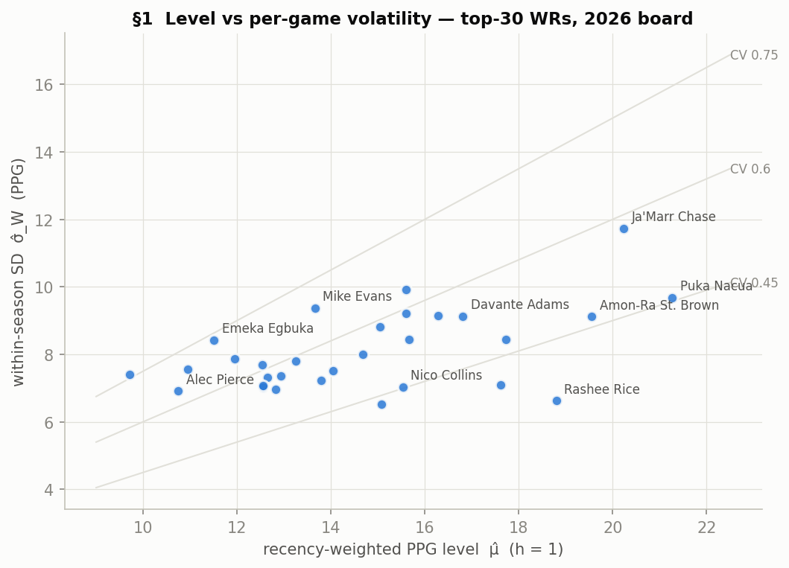
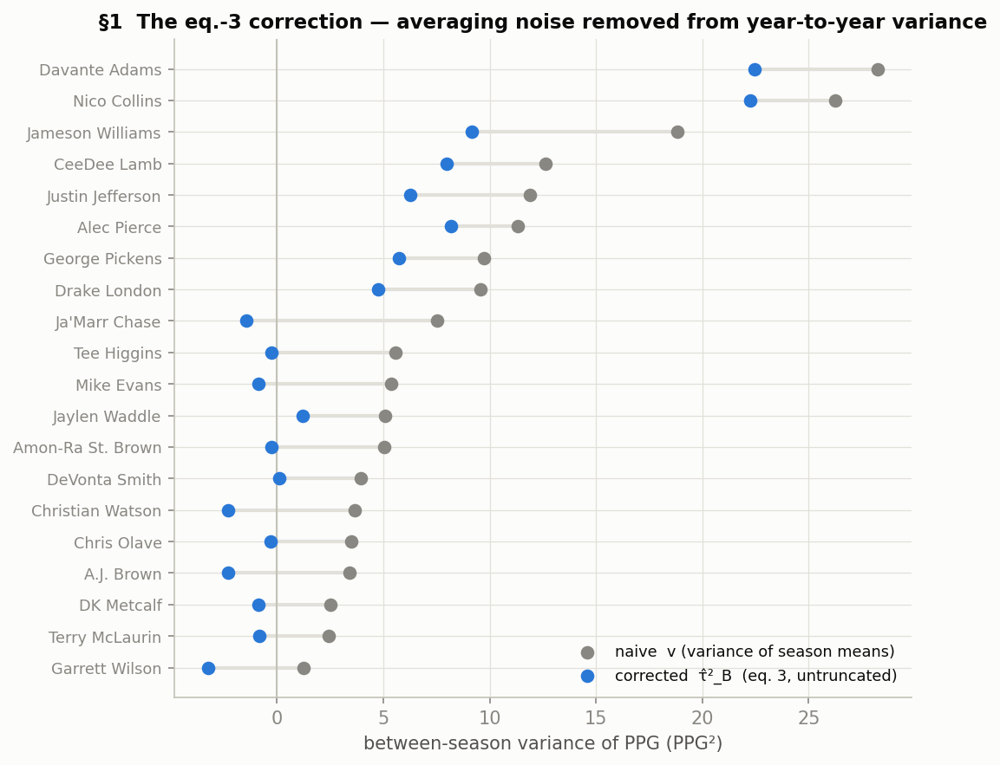

---

## 4. §2 — Variance decomposition: how much of this is even predictable?

**Intuition.** Before building any forecast, ask what the best possible one could achieve.
Decompose a game score into four independent layers — who the player *is* (stable skill), what
this *season* is for him (role, health, QB fit), what his *team environment* is this season,
and single-game randomness. Only the first layer carries across seasons, so its share sets a
hard ceiling on history-only prediction.

**Model** (REML mixed model; primary window 2021–2025, 1,655 games):

    Y_isg = μ + a_i + b_is + c_{t(i,s),s} + ε_isg                                    (4)
    a_i ~ N(0, σ²_P),  b_is ~ N(0, σ²_S),  c_ts ~ N(0, σ²_T),  ε ~ N(0, σ²_G)

The covariance of any two observations is the sum of the variances of the terms they share:
same player+season σ²_P+σ²_S+σ²_T; same player across seasons σ²_P only; teammates σ²_T.

**The ceiling, derived.** With balanced G games, Var(Ȳ_is) = σ²_P + σ²_S + σ²_T + σ²_G/G
while Cov(Ȳ_is, Ȳ_i,s+1) = σ²_P (only a_i survives the season change), so

    ρ_max = σ²_P / (σ²_P + σ²_S + σ²_T + σ²_G/G)                                     (5)

is the maximum correlation any history-only preseason forecast can achieve with next-season
PPG; R² capped at ρ²_max.

**The shrinkage it implies (BLUP).** Cov(a_i, Ȳ_i·) = σ²_P and Var(Ȳ_i·) = σ²_P + W/n_i
with W = σ²_S + σ²_T + σ²_G/G, so the best linear predictor of skill from n_i seasons is

    â_i = κ_i (Ȳ_i· − μ),   κ_i = σ²_P / (σ²_P + W/n_i)

— short careers get automatically pulled toward the population mean. §6 upgrades "population
mean" to the ADP-implied prior.

**Results** (REML headline; MoM cross-check and all sensitivities in
`results/variance_components.csv`):

| spec | σ̂²_P | σ̂²_S | σ̂²_T | σ̂²_G | ρ_max (G=17) |
|---|---|---|---|---|---|
| **2021–25, exclusions (headline)** | **5.48** | **2.48** | **1.20** | **69.93** | **0.413** |
| 2014–25 + season FE | 5.32 | 2.78 | 1.55 | 70.42 | 0.386 |
| log(1+Y), 2021–25 | .0373 | .0103 | .0110 | .403 | 0.454 |
| 2021–25, no exclusions | 6.05 | 2.67 | 1.42 | 71.17 | 0.422 |

**Findings.**
- **Game noise is 88% of single-game variance.** Of season-mean variance (13.27): 41% stable
  skill, 28% next-year context (σ²_S + σ²_T), 31% irreducible σ²_G/17.
- **ρ_max ≈ 0.41** (stable 0.39–0.45 everywhere) ⟹ history-only R² ceiling ≈ 0.17.
- Anomaly chased: lag-1 same-player covariance = 7.74 > σ̂²_P = 5.48 ⟹ player×season
  deviations *persist*; an adjacent-season predictor's ceiling is ≈ 7.74/13.27 ≈ **0.58**.
  The 0.41→0.58 gap is exactly the room context covariates and market information can occupy.
- σ²_T is weakly identified (only 20 team-seasons contain ≥2 board WRs); estimators disagree
  on the σ²_S/σ²_T split, agree on the sum.
- Residuals right-skewed (+0.78), as PPR must be; log1p over-corrects (−0.99) — identity kept.

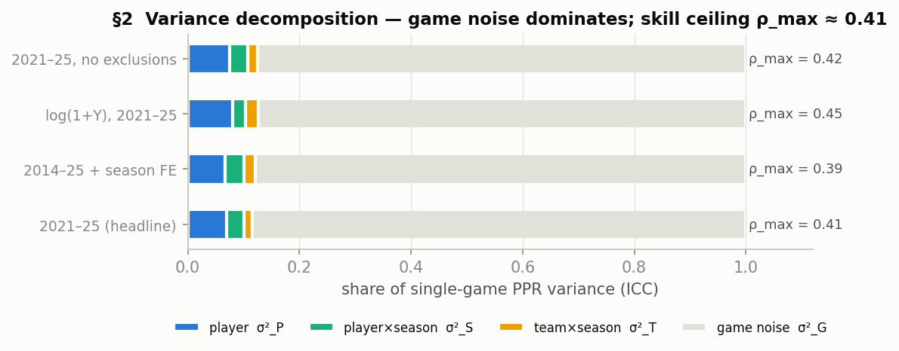

---

## 5. §3 — Does game-level variance differ by experience? (No — and why that's fine)

**Intuition.** The design assumption was that rookies are wilder game-to-game, so their data
should count for less. Rather than assume it, model the residual *scale*:

    Y_isg = μ_is + ε_isg,   ε ~ N(0, σ²_is),   log σ²_is = γ₀ + γ₁·1{rookie} + γ₂·1{soph}   (6)

**Estimation, two routes.** (A) *Harvey:* residual e ≈ σZ, Z ~ N(0,1), so log e² = log σ² +
log Z², and log Z² has known moments — Z² ~ χ²₁, E[log χ²₁] = ψ(½) + log 2 = −(γ_E + log 2) ≈
−1.2704, Var = ψ′(½) = π²/2 — so OLS of log e² on tier dummies is consistent for the slopes
(the constant only shifts the intercept). (B) *Gamma GLM (headline):* e²/σ² ~ χ²₁ =
Gamma(½, 2) ⟹ E[e²] = σ², Var[e²] = 2σ⁴ — a gamma GLM with log link, dispersion 2; iterated
with the weighted mean step this is exactly full ML. Sample: all WRs 2014–2025 with ≥3
targets/game seasons — 19,096 games, 1,926 player-seasons (293 rookie / 308 soph / 1,325 vet).

**Result: the expectation FAILED, informatively.**

| tier | variance multiplier exp(γ̂) vs vet | 95% CI |
|---|---|---|
| rookie | **0.844** | 0.76–0.94 |
| sophomore | 0.921 | 0.84–1.01 |

Jointly significant (χ²(2) = 10.7, p = .005) — in the *opposite* direction: rookies are less
volatile game-to-game. Chased to its cause: **a level effect.** Variance scales as σ² ∝ μ^1.4
(log e² on log μ slope 1.41); controlling for scoring level, the multipliers collapse to
~1.0, n.s. Rookies are exactly as noisy *relative to how much they score* — they score less.
**"Rookie uncertainty" is between-player — not knowing which rookie you drafted — and lives in
τ² and n_eff (below), not in game noise.** Spec unchanged; σ̂²(tier) = 36.4/39.7/43.1 PPG²
used as estimated.

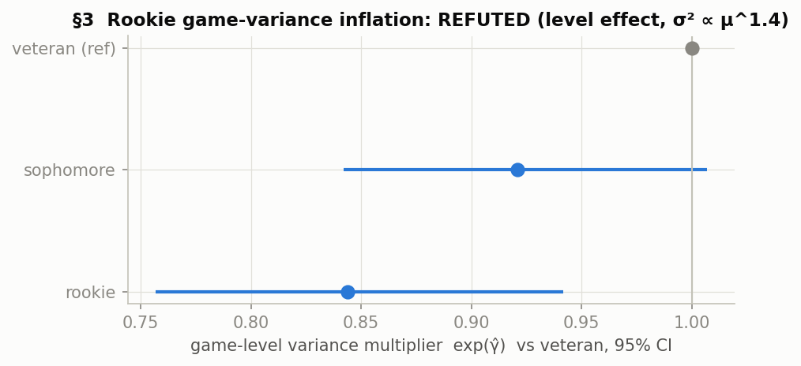

---

## 6. §4 — The reliability gate: which stats are allowed to be covariates

**Intuition.** Before any stat may predict anything, it must demonstrate it measures something
real (split-half reliability: does it agree with itself within a season?) and something that
persists (year-over-year correlation). A stat failing these is season-level noise, and letting
it into a regression is how false edges get manufactured.

**Framework.** True-score model X = T + u, reliability ρ_X = Var(T)/Var(X). Split a season
odd/even weeks: X_A = T + u_A, X_B = T + u_B (independent errors, variance σ²_h), so
r_half = σ²_T/(σ²_T + σ²_h). The full season is the average of halves (error σ²_h/2), so
substituting σ²_h = σ²_T(1−r)/r:

    ρ_full = 2·r_half / (1 + r_half)          (Spearman–Brown)                        (8)

Year-over-year, under stationarity, r_YoY = ρ_X·φ_X where φ_X = Corr(T_s, T_{s+1}) — so
comparing r_YoY to ρ_full separates "noisy stat" from "reliable stat, moving role."
**Pre-registered admission rule:** ρ_full ≥ 0.5 AND r_YoY bootstrap CI excludes 0.
Sample: all 691 WRs 2014–2025 (reliability is a property of the stat, not of our 30).

**Results** (`results/reliability_table.csv`):

| stat | ρ_full | r_YoY [95% CI] | verdict |
|---|---|---|---|
| target share | .896 | .703 [.652, .742] | **ADMIT** |
| WOPR | .893 | .708 [.660, .747] | **ADMIT** |
| air-yards share | .874 | .709 [.662, .750] | **ADMIT** |
| aDOT | .809 | .666 [.605, .711] | **ADMIT** |
| PPR PPG | .802 | .644 [.590, .690] | **ADMIT** |
| RACR | .515 | .313 [.221, .593] | ADMIT (winsorized only) |
| receiving EPA/game | .453 | .321 | REJECT |
| yards/target | .334 | .215 | REJECT |
| TD/target | .235 | .122 | REJECT |

Usage is signal; efficiency is mostly luck at season resolution — **TD rate in particular is
noise**, now with numbers attached. RACR's bizarre CI was traced to gadget seasons with
aDOT < 2 exploding the ratio; admitted in winsorized form only.

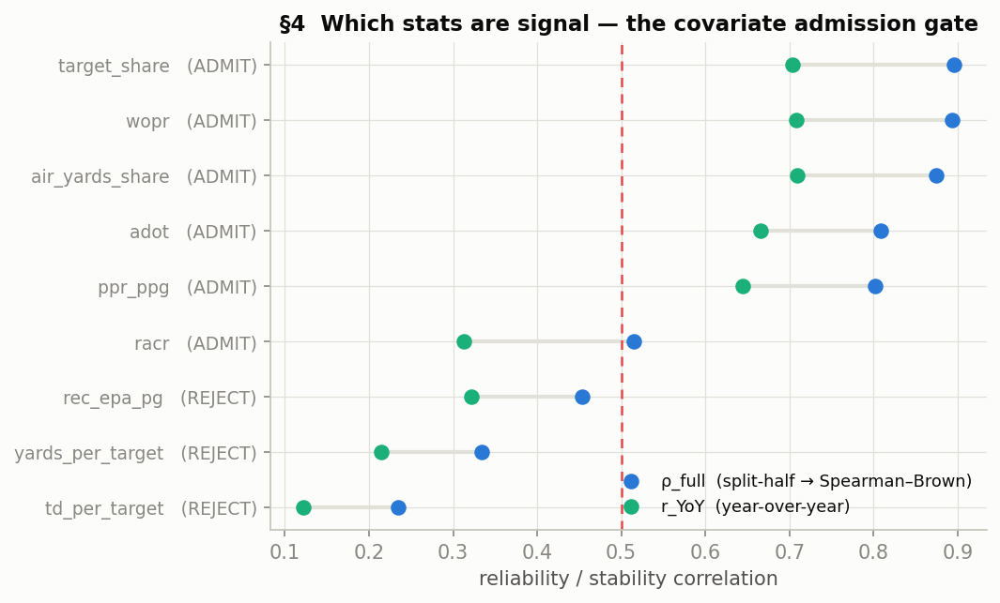

---

## 7. §5 — Covariate structure: age, environment, archetype

**7a. Age curve — and why its linear part is unidentifiable.** For player i in calendar year
y: age = A_i + e_is and y = Y_i + e_is (A = entry age, Y = entry year), so age − y is constant
within player. Once player intercepts absorb (A_i, Y_i), {age, experience, year} are
perfectly collinear — the age–period–cohort problem. Only the *shape* of the age function is
identified. Spec: Y = f(age) + δ_year + a_i + ε, natural cubic spline df 4, on 16,566 games /
383 WRs. **Results: peak 25.8; decline −0.42 PPG/yr at 28, −0.71 at 30, −0.92 at 32**
(≈ 5.3 PPG peak → 34). "High-aDOT receivers decline steeper" is directional (−1.14 vs
−0.82/yr at 32) but p = 0.11 in the honest sample; the top-30-only version (p = .009) was
*rejected* as survivorship-contaminated — conditioning on making a 2026 board is future
information.

**7b. Team-environment elasticity.** Within player-season (Frisch–Waugh–Lovell: demean
everything within player-season, so "good players play on passing teams" selection cannot
enter): log(1+Y) = α_is + β₁ log(team pass attempts) + β₂ team pass EPA + ε, clustered by
team-week. **β₁ = 0.550 [0.514, 0.587]** — a 10% team-volume swing moves a WR's scoring
≈ 5.5%; the efficiency channel is slightly stronger per SD (reflection caveat: own production
sits inside team EPA — upper bound).

**7c. Archetypes.** GMM on standardized (aDOT, target share, YAC/rec, TD/target, slot flag);
BIC picks k = 3. Means differ (ANOVA F = 30.4, p ≈ 1e-13) and — the interesting part —
**variances differ (Levene on |Y − cluster median|: W = 36.4, p ≈ 2e-16)**; the downfield
cluster is the most volatile per unit of level (CV .76 vs .70). Data-quality catch: the NGS
slot label is ~0% populated for active players — the labeled "slot" cluster is definitional,
and **the slot label is banned downstream**; a continuous-features-only clustering reproduces
k = 3 (our 30 map to 23 volume-primary / 4 YAC / 3 TD-dependent profiles).

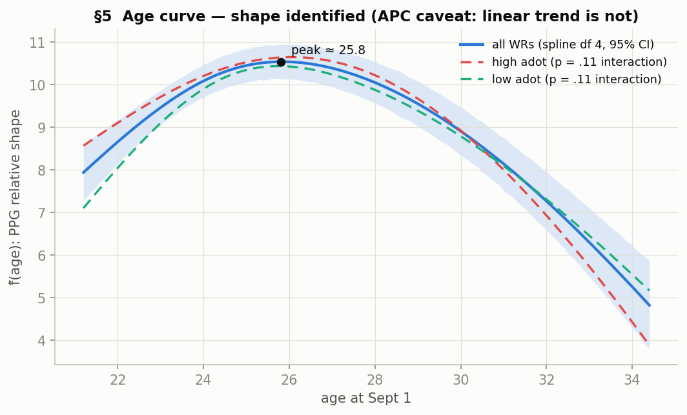

---

## 8. §6.1 — The market prior: what an ADP is worth, and how wrong it tends to be

**Intuition.** To use ADP as a prior we need two numbers: what a given ADP has historically
*meant* in PPG (the prior mean), and how widely outcomes *spread* around that meaning (the
prior variance — how much the market tends to be wrong, by experience tier).

**Panel.** Top-30 WRs by ADP each year 2015–2024 joined to realized same-season PPG:
300 player-years, 300/300 name-matched (three documented identity resolutions, including
catching a silent match to a 1990s player of the same name via an impossible 0-game season);
291 rows meet the pre-registered ≥ 4-game fit floor.

**Fits.**
- m̂(ADP): isotonic monotone-decreasing in log ADP — 20.5 PPG at the top of the board to 8.7
  at ADP 75; beats OLS (RMSE 3.32 vs 3.40). OLS reference: PPG = 22.57 − 2.32·log ADP (R² .225).
- τ̂²(tier) = Var(realized − m̂(ADP) | tier): **rookie 24.5** (n = 4! CI 1.7–35.1),
  **soph 7.9** (n = 36, CI 5.0–11.0), **vet 11.3** (n = 251, CI 9.3–13.2).
- **The expected ordering rookie > soph > vet FAILED** (soph < vet, n.s., Levene p = .39):
  the rookie cell is nearly unidentified (boards almost never carried rookies), and vet τ² is
  inflated by injury-shortened and age-cliff seasons while board sophomores are
  durability-selected. Used exactly as estimated — no ordering imposed.

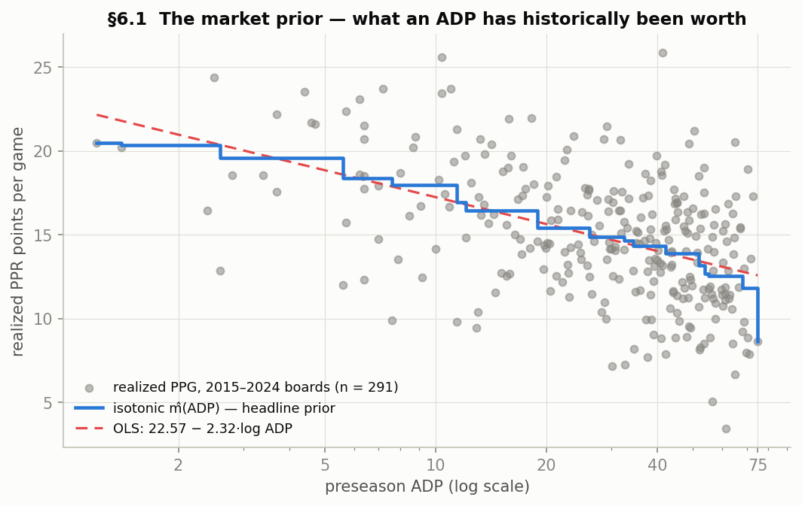
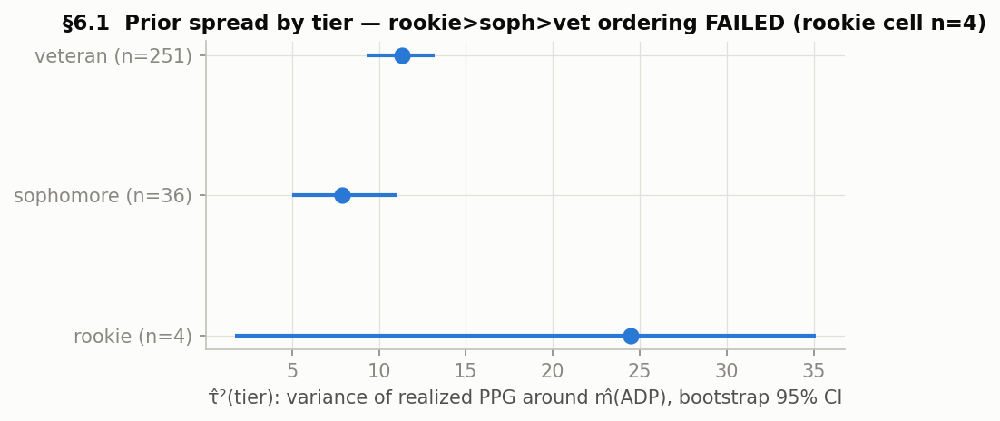

---

## 9. §3.4/§6.4 — The posterior: combining a player's history with his price

**Derivation.** With prior θ_i ~ N(m(ADP_i), τ²(e_i)) and likelihood μ̂_i | θ_i ~ N(θ_i, V_i),
V_i = σ̂²(e_i)/n_eff,i, the posterior is ∝ exp{−(μ̂−θ)²/2V − (θ−m)²/2τ²}; completing the
square in θ:

    θ_i | data ~ N( θ*_i , (1/V + 1/τ²)^{-1} ),
    θ*_i = (1 − B_i)·μ̂_i + B_i·m(ADP_i),   B_i = V_i/(V_i + τ²_i)                    (7)

A precision-weighted average: no data (n_eff → 0) ⟹ B → 1, the price *is* the estimate; a
long recent history ⟹ B → 0. Every ingredient is estimated: μ̂/n_eff (§1), σ²(tier) (§3),
m(·) and τ²(tier) (§6.1). **No covariate adjustments enter** because nothing survived §6.2
(next section) — so the final valuation *is* this blind posterior.

Observed shrinkage on the 2026 board: B ∈ [0.56, 0.84] — always market-leaning, as it must be
with only 1.0–3.0 effective seasons per player; the three 1-season sophomores get B = 0.835.

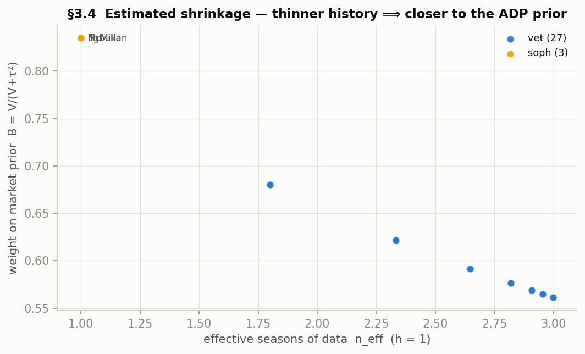

---

## 10. §6.2 — Testing for edge in the market's errors: nothing survives

**Intuition.** If the market misprices systematically, some preseason-knowable variable must
predict its residuals R = realized PPG − m̂(ADP). Regress R on a *pre-specified* covariate set
(gate survivors + demographics + one pre-registered addition — prior-season games played,
motivated by the §9 diagnostic that per-game history is blind to availability), and demand
survival of BOTH multiple-testing control and a temporal holdout. Under market efficiency,
every β = 0.

**Spec.** R = Z′β + u on the 285 usable panel rows; SEs clustered by season (10 clusters,
t with 9 df); BH-FDR at q = 0.10 across the 10-term family; then refit on 2015–2022 and
require improved squared-error prediction on 2023–2024 (2025 doesn't exist at the source).

**Results** (`results/edge_regression.csv`):

| term | β̂ | t (9 df) | FDR | holdout | survives |
|---|---|---|---|---|---|
| age | −0.124 | −1.54 | ✗ | — | no |
| team change | +0.005 | 0.01 | ✗ | — | no |
| prior target share | −7.34 | −0.43 | ✗ | — | no |
| prior aDOT | −0.242 | −1.39 | ✗ | — | no |
| prior WOPR | +2.31 | 0.29 | ✗ | — | no |
| prior games played | −0.023 | −0.37 | ✗ | — | no |
| rookie | −6.87 | −14.1 | ✓ | fails | **no** |
| vet × team change | +0.005 | 0.01 | ✗ | — | no |
| age × aDOT | −0.024 | −0.85 | ✗ | — | no |
| rookie × new-team pass EPA | −4.04 | −5.93 | ✓ | fails | **no** |

The two FDR passers are artifacts of the **n = 4 rookie cell** (rookies appear in only 2 of 10
season-clusters, making clustered t's degenerate), and both *fail* the holdout — adding them
makes out-of-sample prediction worse, dramatically so in LOSO (see §11). **Within this
covariate set and panel: no systematic market mispricing found.** Reported plainly; no
fishing beyond the pre-specified Z.

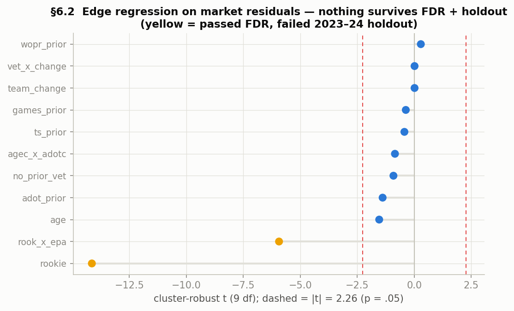

---

## 11. §7 — Validation: does any of this beat blind ADP?

**Design.** Leave-one-season-out over 2015–2024. For each held-out year Y, *everything* is
refit without it — m(·), τ²(tier), σ²(tier) — and each board player's μ̂/n_eff is rebuilt from
data strictly before Y. Verified leak-free (one leakage bug was found in the edge-arm's
residual target during verification, fixed; headline predictors bit-identical before/after).
Scoring vs the ADP-only baseline: RMSE, mean within-year Spearman, and a paired
Diebold–Mariano-type test on squared-error differences, clustered by year, t with 9 df.

**Scorecard** (`results/loso_scorecard.csv`):

| predictor | RMSE | mean Spearman | DM vs ADP-only |
|---|---|---|---|
| (i) ADP-only m̂(ADP) | 3.564 | .461 | — |
| **(ii) blind posterior θ*** | **3.463** | **.467** | **t = 2.68, p = .025** |
| (iii) θ* + FDR-passing edge terms | 6.469 | .459 | worse (p = .35) |

**Findings.**
- **The blind posterior beats blind ADP out of sample**: −2.8% RMSE, better in 7/10 folds,
  significant at the pre-registered test. The edge comes from the empirical-Bayes blend
  itself — a player's own recency-weighted history is worth adding to his price — not from
  any clever covariate.
- Predictor (iii) is a cautionary tale in one row: terms that passed FDR but failed the
  holdout *double* the RMSE when used (degenerate rookie-cell coefficients meet a new
  season's rookies). The two-hurdle discipline is what kept it out of the final model.
- Honest sensitivity: excluding the 2015 fold p = .056; excluding 2015+2016 p = .046; the
  RMSE edge is stable ~2.7–3.1% in every subset. Ten seasons = ten clusters is the test's
  real resolution; the result is real but near the boundary.
- 2015-fold trace: 18/30 of that board have careers truncated at the 2014 data edge; their
  μ̂ is biased +1.5 PPG but n_eff is *deflated* to 1.0, so B ≈ 0.81 shrinks them harder to
  market and net posterior bias is only −0.26. A residual +1.1 μ̂ bias for old-career players
  persists in later folds — an *age* effect (μ̂ has no age curve in it), the strongest
  documented argument for the next iteration.

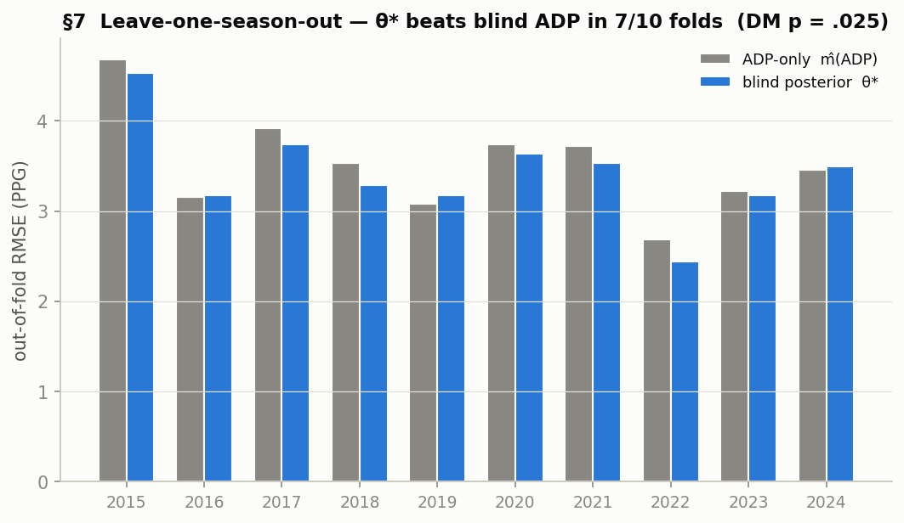

---

## 12. The 2026 board — final valuation

Since no edge term survived, final = the blind posterior (7). Posterior SD ≈ 2.5–2.8 PPG on
every row — the honest error bar implied by §4's variance structure. Full file:
`results/valuation_2026_final.csv`.

| rank | WR | ADP | mkt rank | μ̂ | B | θ* | ±SD | Δ vs market |
|---|---|---|---|---|---|---|---|---|
| 1 | Puka Nacua | 2.8 | 1 | 21.27 | .62 | 20.20 | 2.6 | 0 |
| 2 | Ja'Marr Chase | 3.9 | 2 | 20.23 | .66 | 19.84 | 2.5 | 0 |
| 3 | Amon-Ra St. Brown | 7.6 | 4 | 19.55 | .66 | 18.62 | 2.5 | +1 |
| 4 | Jaxon Smith-Njigba | 6.1 | 3 | 17.61 | .62 | 18.09 | 2.6 | −1 |
| 5 | CeeDee Lamb | 10.6 | 6 | 17.72 | .67 | 17.85 | 2.5 | +1 |
| 6 | Justin Jefferson | 10.0 | 5 | 15.60 | .67 | 16.93 | 2.5 | −1 |
| 7 | Rashee Rice | 27.3 | 15 | 18.80 | .62 | 16.36 | 2.6 | **+8** |
| 8 | A.J. Brown | 14.2 | 8 | 16.28 | .68 | 16.36 | 2.5 | 0 |
| 9 | Drake London | 12.6 | 7 | 15.66 | .65 | 16.13 | 2.6 | −2 |
| 10 | George Pickens | 17.4 | 9 | 14.68 | .65 | 15.71 | 2.6 | −1 |
| 11 | Nico Collins | 23.2 | 11 | 15.53 | .66 | 15.45 | 2.5 | 0 |
| 12 | Davante Adams | 40.0 | 20 | 16.81 | .69 | 15.41 | 2.5 | **+8** |
| 13 | Chris Olave | 21.2 | 10 | 15.07 | .65 | 15.26 | 2.6 | −3 |
| 14 | Tee Higgins | 26.4 | 13 | 15.04 | .67 | 14.95 | 2.5 | −1 |
| 15 | Zay Flowers | 25.4 | 12 | 13.79 | .62 | 14.79 | 2.6 | −3 |
| 16 | Garrett Wilson | 27.0 | 14 | 14.05 | .65 | 14.54 | 2.6 | −2 |
| 17 | Malik Nabers | 43.6 | 22 | 15.60 | .77 | 14.44 | 2.8 | +5 |
| 18 | Tetairoa McMillan | 33.4 | 17 | 12.55 | .84 | 14.28 | 2.6 | −1 |
| 19 | DeVonta Smith | 28.5 | 16 | 13.25 | .66 | 14.19 | 2.5 | −3 |
| 20 | Mike Evans | 51.2 | 26 | 13.66 | .69 | 13.79 | 2.5 | **+6** |
| 21 | Ladd McConkey | 35.3 | 18 | 12.56 | .77 | 13.76 | 2.8 | −3 |
| 22 | Terry McLaurin | 36.6 | 19 | 12.82 | .68 | 13.67 | 2.5 | −3 |
| 23 | Emeka Egbuka | 45.5 | 24 | 11.51 | .84 | 13.50 | 2.6 | +1 |
| 24 | Jameson Williams | 47.2 | 25 | 12.65 | .65 | 13.39 | 2.6 | +1 |
| 25 | Jaylen Waddle | 42.2 | 21 | 12.54 | .66 | 13.32 | 2.5 | −4 |
| 26 | Luther Burden III | 45.2 | 23 | 9.72 | .84 | 13.20 | 2.6 | −3 |
| 27 | DK Metcalf | 56.2 | 28 | 12.93 | .68 | 12.71 | 2.5 | +1 |
| 28 | Christian Watson | 60.1 | 30 | 11.95 | .65 | 12.30 | 2.6 | +2 |
| 29 | Rome Odunze | 54.9 | 27 | 10.96 | .77 | 12.11 | 2.8 | −2 |
| 30 | Alec Pierce | 59.4 | 29 | 10.75 | .65 | 11.81 | 2.6 | −1 |

The risers (Rice, Adams, Evans, Nabers) share one profile: strong per-game history, real
availability/age risk the market prices and per-game PPG cannot see. That was tested — the
availability covariate did *not* rescue the market's side (§10) — but the model's error bars
say treat the disagreements as ~1-posterior-SD leans, not certainties.

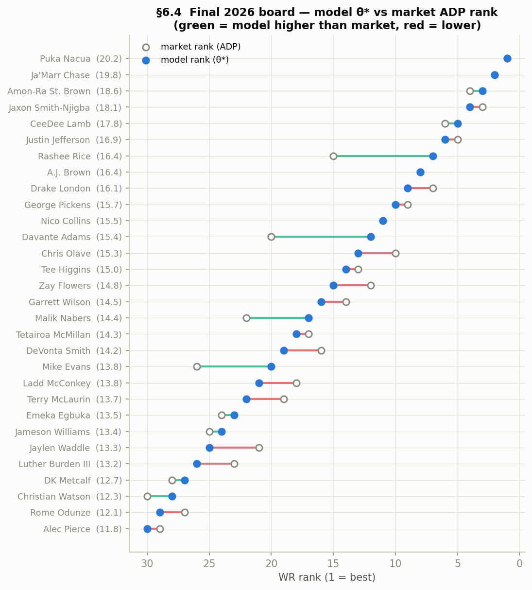

---

## 13. Limitations & the next iteration

1. **μ̂ has no age curve in it** — the verified +1.1 PPG bias for old-career players is the
   single clearest improvement: replace μ̂ with an age-detrended projection (§5's f̂ exists).
2. **Availability is conditioned away** — everything is per-game-given-participation; games
   played should be *modeled* (a durability outcome), not just tested as a covariate.
3. **The 0.41 → 0.58 ceiling gap** — persistent player×season structure says a target-share-
   based projection of μ (usage is the reliable stat) should beat raw PPG history.
4. **Rookies are unidentified everywhere** (n = 4 in ten years of boards) — rookie valuation
   needs a different data design (draft capital, college production priors), not this panel.
5. Ten seasons is ten clusters — every market-level test runs at that resolution; the headline
   p = .025 sits near the boundary (p = .046–.056 excluding edge folds).
6. No snap/route data in this table (targets proxies participation); nflverse snap counts are
   a one-pull upgrade.

---

# Part II — Round 2: Availability, Situation Change, and Better Data Arms

*Pre-registered in `EDA_PLAN2.md` (2026-07-15) before any round-2 fitting; executed by three
parallel researchers; round-1 outputs frozen (arm (ii) reproduced to machine precision before
any comparison ran). Lab notes: `results/section{A,B,C,D}_notes.md`.*

## 14. §A — Availability as a modeled outcome

New data: nflverse snap counts and weekly injury reports, 2014–2025 (`data/snap_counts/`,
`data/injuries/`; 98.5% gsis_id join coverage for fantasy-relevant WRs).

**Is injury-proneness a stable trait? Yes — with a composition caveat.** Availability rate
p̂ = G/M (games with ≥2 targets over scheduled games): YoY r = 0.422 [0.363, 0.477];
hierarchical beta-binomial between-player SD 0.295, ICC-analogue 0.364; parametric bootstrap
vs pure binomial+age: observed variance ≈ 80× the null's 95th percentile, p < .001. Chased:
among established starters only, YoY r falls to 0.158 — much of the trait at the fringe is
*role* persistence, not health. Game-level logistic: a 17- vs 8-game prior season ≈ 2.7× the
participation odds; age −0.055/yr on top (p = .0001).

**Season-value arm (iv): SV = θ* · Ê[G]/M, scored on points per scheduled week** — the
target where the market's availability knowledge should win by default. Result: RMSE 4.230
vs 4.346 for the re-fit ADP-only baseline, better in 8/10 folds, **DM t = 3.53, p = .006** —
the strongest validation number in the project. Decomposed honestly: a fold-constant league
availability (θ* × p̄) captures most of it (p = .087 vs baseline; player-specific vs constant
head-to-head t = 0.46) — so the certified gain is θ* *plus correct scaling to expected
participation*; differential "he specifically will miss games" prediction is directionally
right but not separately significant (predictable spread ~0.05 SD vs realized binomial noise
~0.09). Including total-wipe-out seasons (n = 300): p = .16 — season-ending disasters are
coin flips.

## 15. §B — Situation change: real in production, priced in the market

Derived tables (`data/derived/`): primary QB per team-season, player-season change flags
(team change 21.3%/yr, QB-change-same-team 29.0%), vacated target share per team-season
(league mean 0.294; extremes face-valid).

- **B1 — carryover does NOT degrade.** Target-share YoY slope 0.868 (no change) / 0.857
  (team change) / 0.812 (QB change); equality p = .59 (same for WOPR, aDOT). The reliability
  that admitted the usage stats survives context turnover.
- **B2 — production moves.** Within-player ΔPPG: **team change −1.00 PPG (p = .009)** —
  robust to drop-one-season, strengthens to −1.58 controlling current level (not
  mean-reversion). **Vacated targets +1.92 (p = .004)** — chased to an *incumbent* effect
  (stayers inherit departed targets; mostly mechanical redistribution — controlling ΔTS
  collapses it to +0.82, p = .053). QB change alone: null.
- **B3 — the market prices it: full null.** {team change × vacated, team change × new-team
  EPA, QB change} on market residuals: zero FDR survivors, family fails holdout. Coherent
  with round 1: situation change is real in production space, efficient in price space.

## 16. §C/§D — Better data arms: the blind posterior survives

**§C age-detrend** (per-fold f̂ refit on ≤Y−1; FE version of the §5 spline — peak 25.9 vs
25.8, sanctioned in plan). It fixes what it targeted — pre-2014-career μ̂ bias +1.12 → +0.76,
exp-9+ bias +2.74 → +1.76 (+0.69/row gain) — but introduces overshoot at exp 3–5 (+0.33 →
+1.03): the survivor-censored up-slope near the peak banks role expansion the market already
priced. **Net: an exact wash — DM vs (ii): p = .983.**

**§D usage projection** (fold-honest ridge on target share, WOPR, aDOT, team attempts, age;
the TS+WOPR composite is stable 2.82–3.11 across folds despite coefficient collinearity
wobble). It *underperforms* on a market-selected board: raw ŷ biased −1.48 PPG on board
players — a population-level ridge shrinks stars toward the population line, and the §4 gate
that (correctly) excluded efficiency stats removes exactly what distinguishes them. It does
win in the top market tercile (+0.28/row: called the Julio-2021/Kupp-2023-type collapses) but
loses everywhere else. **DM vs (ii): p = .168, worse point estimate.**

**Extended scorecard** (realized PPG target; `results/loso_scorecard2.csv`):

| arm | RMSE | Spearman | DM vs ADP-only | DM vs blind θ* |
|---|---|---|---|---|
| (i) ADP-only | 3.564 | .461 | — | p = .025 (worse) |
| **(ii) blind θ* (round 1)** | **3.463** | **.467** | **p = .025** | — |
| (v) age-detrended θ*ᵃ | 3.462 | .471 | p = .091 | p = .983 |
| (vi) usage posterior | 3.595 | .403 | p = .685 | p = .168 |
| (v+vi) | 3.608 | .394 | p = .525 | p = .115 |

**The 2026 board is unchanged** — no arm met the pre-specified adoption rule
(`results/valuation_2026_v2.csv` restates round 1 and says so; the not-adopted age-detrend
board, for the record, would move Adams −1.0 and Evans −0.9 PPG: `sectionC_2026.csv`).

## 17. What two rounds establish

1. Production dynamics are real and modelable: a stable availability trait, a −1 PPG
   team-change cost, vacated-target inheritance, an age curve peaking at ~26.
2. The top-30 ADP market prices essentially all of it: every named covariate — age, moves,
   usage, availability, situation quality — fails the two-hurdle edge test, in two rounds.
3. The certified edges are structural, not clever: **(a)** the empirical-Bayes blend of a
   player's own history with the price (p = .025 on PPG), and **(b)** scaling per-game value
   by expected participation when the target is season value (p = .006 on points per
   scheduled week). Both survive out-of-sample at ten-season resolution.
4. Honest boundaries: rookie cells are unidentified everywhere; ten clusters is the test's
   resolution; wipe-out seasons are unforecastable; and improving on θ* now likely requires
   information *outside* this data (camp/depth-chart context, injury specifics) rather than
   recombinations of it.

---

# Part III — Round 3: 2026 Context and Teammate Coherence

*Pre-registered in `EDA_PLAN3.md` (2026-07-16). Motivation: θ*'s data arm ignores draft-time
context (offseason moves, vacated targets) that the market arm prices; and valuations are
computed independently although within-team target share sums to 1 (five 2026 teams carry
two board WRs). Lab notes: `results/section{E,F}_notes.md`.*

## 18. §G0 — Current-team data

Sleeper player dump (`data/sleeper/`, 12,200 records) matched 30/30 board players and all 108
fantasy-relevant 2025 WRs (a name-normalization fix was required — Josh/Joshua Palmer-type
false departures — documented). **2026 board movers: A.J. Brown PHI→NE, Waddle MIA→DEN,
Evans TB→SF** (0/30 disagreements vs the FFC team field). 2026 vacated-target shares per team
(`data/derived/vacated_2026.csv`; league mean .258 vs .294 historical): MIA .530 and WAS .523
lead; Waddle enters a DEN room with .021 vacated — nothing to inherit.

## 19. §E — Context-adjusted data arm: NOT adopted, and the reason is the finding

Arm (vii): μ̂ᶜ = μ̂ + β̂_tc·mover + β̂_vac·(entering-team vacated − mean), β's refit per LOSO
fold on ≤Y−1 data. Scorecard: RMSE 3.4724 vs (ii)'s 3.4631, DM vs (ii) t = −0.81 (p = .44) —
fails both adoption prongs. Chased to its mechanism: **because the market already prices
moves (round-2 B3), pushing the population −1 PPG mover effect into the data arm
double-counts it** — θ* already receives the move through m(ADP) at weight B ≈ 0.66.
Excluding a degenerate 2017 fold (β_tc fit on one training season, wrong sign), movers are a
wash (−0.11/row). A bias fix helps only when the *data arm itself* is wrong (age, §C targeted
cell), not when the information already enters through the prior. The not-adopted board
(`sectionE_2026.csv`): Waddle −0.64, A.J. Brown −0.44, Evans −0.42 PPG.

## 20. §F — Teammate coherence: the Rams duo is a real flag; the market prices duos anyway

F1 measurement: invert the fold-fit PPG↔usage relation to an implied target share; sum within
2026 duos and place in the historical distribution of *realized* top-2 WR TS sums (n = 384
team-seasons; p90 = .456, p95 = .476):

| 2026 duo | implied TS sum | pct of realized | pct of historical *implied* (fair ref) |
|---|---|---|---|
| LAR Nacua + Adams | .560 | 99.7 | **94.9** |
| DET St. Brown + J. Williams | .521 | >95 | 83 |
| CIN Chase + Higgins | .512 | >95 | ~70 |
| DAL Lamb + Pickens | .507 | >95 | ~50 |
| CHI Odunze + Burden | .426 | 81 | ~30 |

Anomaly chased before trusting the flags: the inversion books θ*'s efficiency as volume, so
implied sums are systematically inflated (62% of historical board duos exceed realized-p90 on
implied TS; only 19% realize it) — hence the fair-reference column, against which **only the
Rams pair remains extreme (94.9th percentile of like-for-like implied sums)**. F2 edge test:
full null (p = .61–.87, no FDR survivor, fails holdout) — historically the market has NOT
systematically mispriced board duos, so per the pre-registered decision rule **F3 (the
constraint arm) was not run**. Net: the coherence number is a legitimate *risk flag* — the
Rams pair jointly implies a target split at the edge of what two WRs have ever sustained, and
the flag lands mostly on the data-arm-driven riser (Adams) — but it does not justify moving
the valuation against a market that has priced duos correctly for a decade.

**Round-3 verdict: `valuation_2026_v3.csv` restates the board with verdicts recorded. Three
rounds, one consistent conclusion: the certified edges remain the shrinkage blend (p = .025)
and availability scaling (p = .006); everything nameable else is priced.**

## Appendix: file map

| layer | files |
|---|---|
| this report | `REPORT.md` |
| protocol (pre-registered math) | `EDA_PLAN.md` |
| narrative process log | `PROCESS.md` |
| figures | `results/figures/fig01–fig12` (generated by `scripts/12_report_figures.py`) |
| tables | `results/*.csv` |
| lab notes per section | `results/section{1,2,3,4,5,6a,6b,7}_notes.md` |
| code, in run order | `scripts/fetch_data.py`, `scripts/01–12` |
| raw data | `data/adp/`, `data/players/weekly_raw/`, `data/teams/`, `data/meta/` |

---

# Part IV — Round 4: The RB Universe, Aging Across Eras, Market Context, and a Views Layer

*Pre-registered in `EDA_PLAN4.md` (2026-08-09), with one dated in-flight amendment to §I3
recorded after sourcing and before any fitting. Executed the same day. This part is written to
the documentation rule now in `CLAUDE.md`: notation defined before use, intuition before algebra,
derivations shown rather than asserted, and design decisions justified against the alternative
that was not chosen. Nulls are documented as fully as adoptions — how we came to reject something
is part of how the model was arrived at.*

---

## 21. Preliminary: what "the ADP implies 14.32 points per game" actually means

This idea carries all of Part IV, and §6.1 above states it compactly enough that it can be read
without being understood. So here it is slowly, from nothing.

**The problem.** We want to value a player. We have two very different kinds of information.
The first is the player's own history — Davante Adams has 175 career games, and they average out
to something. The second is his *price*: the market drafts him, on average, at pick 41.2. These
are in different units. One is points per game; the other is a draft slot. Before we can combine
them we need them on the same scale, which means answering: **what is a draft slot worth, in
points?**

**The key move: don't theorize, measure.** There is no formula converting pick number to points,
and any we invented would encode our own beliefs — exactly what we are trying to avoid. But there
is a decade of evidence sitting right there. Every year, the market posted a price for each
player, and then the season happened and produced an answer. So we can just look up what a price
has historically been worth.

Formally, let

    A_iy  = ADP of player i on the preseason board for year y
    Ȳ_iy  = that player's realized PPG in season y

Our panel is the top 30 WRs by ADP on each FFC board from 2015 to 2024 — 300 (price, outcome)
pairs, of which 291 clear the pre-registered ≥ 4-game floor — and the same construction
independently for RB in §23 below. We are looking for the conditional mean function

    m(a) = E[ Ȳ | A = a ]                                                              (21.1)

read in plain English as: **among all the players history has priced at draft slot a, what did
they actually average?** That is the entire content of "market-implied value." It is a fact about
what prices have been worth, not a theory about what they mean.

**Why isotonic regression and not a line.** We must estimate m(·) from 291 noisy points, so some
structure is needed. The choice of structure *is* the choice of what we are willing to assume.

A straight line — PPG = α + β·log A — assumes the market's pricing is smooth and that each
additional log-slot costs a constant amount of production forever. We fit it for reference
(PPG = 22.57 − 2.32·log A, R² = .225), but we do not believe its premise. There is no reason the
gap between the 3rd and 8th WR off the board should resemble the gap between the 23rd and the
28th.

So instead we assume the *only* thing that is nearly definitional about a market price:

    a₁ < a₂  ⟹  m(a₁) ≥ m(a₂)                                                          (21.2)

**A better draft price implies a weakly better player.** Not strictly better — weakly. That is
all. Isotonic regression finds the monotone function minimising Σ(Ȳ_iy − m(A_iy))², i.e. the
best-fitting curve among all curves that never rise as the price gets worse. It is the
minimal-assumption estimator for this problem, and it earns its place empirically: RMSE 3.32
against the line's 3.40.

**Why the answer comes out as stairs, and why that is a feature.** Isotonic fits are step
functions. Wherever the data cannot establish that one price range outproduces the next, the
algorithm *pools them into a single flat level* rather than inventing a distinction. On the
current WR board the fitted m(·) has 18 distinct levels across ADP 1.4–75, and the WR2/WR3
region is one long near-flat stretch: m falls only from 14.88 to 14.32 across ADP 26 → 42.

The practical consequence is worth internalising before reading any ranking. When Tee Higgins'
ADP fell 12.8 slots between the July and August boards, his implied value fell **0.32 PPG**. The
market moved him a lot; history says prices in that range have not been worth distinguishing.
Conversely a player only 1.09 PPG above his implied value can leap nine rank positions, because
nine positions in that flat stretch is barely a point. **Rank deltas in the middle of the board
are mostly an artifact of a flat curve. Read the value gap, not the rank gap.**

**How this becomes a prior.** Equation (21.1) gives the centre; we also need the spread, because
a prior with no uncertainty is a certainty. Define the tier residual variance

    τ²(e) = Var( Ȳ_iy − m(A_iy) | tier e )                                             (21.3)

— how far outcomes scatter around the price, estimated separately for rookies, sophomores and
veterans (§6.1: 24.5 / 7.9 / 11.3, used exactly as estimated; the expected ordering failed and
was not imposed). Then the market prior for player i is

    θ_i ~ N( m(A_i), τ²(e_i) )                                                         (21.4)

and eq. (7) blends it with the player's own history at the precision-implied weight
B = V/(V + τ²). Nothing in this chain is hand-set.

**Worked example, since this is the one that prompted the question.** Adams' 2026 ADP is 41.2.
The fitted curve gives m(41.2) = 14.32 PPG — players historically priced around pick 41 have
averaged 14.32. His own recency-weighted history over 175 games gives μ̂ = 16.81. His shrinkage
weight is B = 0.56, so

    θ* = (1 − 0.56)·16.81 + 0.56·14.32 = 15.41 PPG

He sits above market because his own production says 16.81 while the market pays for 14.32, and
his history is precise enough to pull the estimate 44% of the way toward it. The "+9" reported
against his ADP rank is **nine rank slots, worth 1.09 PPG** — a small disagreement magnified by
the flat stretch described above. It is not a nine-point claim.

---

## 22. What round 4 asked

Four gaps, in the order they bound the model:

1. The board was WR-only, while half the decisions in play are RBs (§23).
2. Age had been tested as a correction to μ̂ (§C, a tie) but never as the hypothesis that
   *the aging curve itself has moved later in calendar time* (§24).
3. Sportsbook markets price team environment independently of ADP; whether they carry anything
   ADP does not was untested (§25).
4. There was no disciplined channel for subjective input (§26).

Before any of it, a reproduction gate: scripts 01, 06–11, 17, 18 were re-run on the frozen July
inputs and reproduced all 19 round-1–3 result CSVs byte-identically, with `V_final_v3` matching to
max |diff| = 0.0. Every round-4 output is a new dated or position-suffixed file. The ADP itself was
refreshed to the Aug 1–8 pull (5,187 drafts vs July's 1,737).

**What the refresh did.** The board is stable — Spearman(July θ*, Aug θ*) = .977, RMS Δθ* = 0.469,
max |Δrank| = 6. DJ Moore and Courtland Sutton entered; Metcalf and Watson left. The finding worth
recording is that **round 1's single largest disagreement closed by itself**: Rashee Rice moved
from ADP 27.3 to 11.4 and our edge fell from +8 rank slots to +2. We did not become less right; the
market came to the same place in three weeks. Adams' disagreement did not move.

Twelve of 28 continuing players moved *exactly* zero — traced to the step-function geometry of
§21: mean |ADP move| was 1.66 slots for the zero-change group against 6.24 for the rest. They
moved within a step.

---

## 23. §G — The RB universe, refit from nothing

**Design decision, stated first.** Every variance component, reliability weight and market curve
was re-estimated on RB data. Nothing was inherited from the WR pipeline. The alternative — reuse
WR's σ², τ², and shrinkage weights and just swap the player list — would have been far less work
and is the standard shortcut, but it presumes the two positions have the same statistical
structure. That is precisely what we did not know, and as it turns out it is false.

**Notation carries over from §1** with e now indexing RB experience tiers and G a game.

**§G1 Participation filter.** WR drops player-games with targets ≤ 1; the RB analogue drops
touches (carries + targets) ≤ 1. The magnitudes differ enormously and the difference is itself
informative: **17.20% of RB board-player games are excluded at a mean of 0.454 PPR points**,
against 1.9% at 1.9 points for WR. Backup-and-committee non-participation is an order of magnitude
more common than WR decoy games. Boom/bust thresholds were re-derived from the RB distribution
(p75/p25 = 13.8 / 3.2) rather than reusing WR's 20/8, and fixed before fitting.

**§G2 Variance components.** Using the same REML decomposition as §2 (player, season, team, game):

| | σ²_P | σ²_S | σ²_T | σ²_G | ρ_max |
|---|---|---|---|---|---|
| WR | 5.48 | 2.48 | +1.20 | 69.93 | .413 |
| **RB** | **7.06** | **5.78** | **0.00** (boundary) | **63.50** | **.426** |

The headline is σ²_S, the season-to-season movement in a player's own level: **2.3× the WR value**.
Game-level noise is *lower* for RBs, and the ceiling on predictability ρ_max is essentially
identical. So the difference is not that RBs are noisier week to week — it is that **an RB's level
moves much more between seasons**. The same fact appears directly in the adjacent-season
persistence of season means: **RB 0.245 against WR 0.570**.

That single comparison is the most useful number in Part IV for anyone forming a view. An RB's own
history tells you well under half of what a WR's does about next season.

Consistently, τ̂²_B (eq. 3, the bias-corrected between-season variance) does **not** collapse to
zero for RBs the way it does for WRs: only 4 of 17 come out negative, median untruncated +5.95,
against WR's 10 of 20 and −0.08. For WRs, movement in season means is nearly all averaging noise.
For RBs it is real.

**§G3** repeats §21's construction on the RB panel, yielding RB-specific m(·) and τ²(e). The RB
rookie tier is estimated on n = 25 rather than WR's n = 4, so RB thin-data shrinkage rests on a
real estimate rather than a near-fiction.

**§G6 LOSO — the honesty clause fires.** Pre-registration required adoption only on a
Diebold-Mariano improvement over market-only, clustered by year. Arm (ii), the blend of eq. (7):
RMSE 3.9047 → 3.8378, **DM t = +0.766, p = .4635**, winning 5 of 10 folds. Arm (iii),
availability-scaled: p = .699. **Neither adopted. The RB board is market-anchored:
board_value = m(ADP).** No further arms were tried, per the rule fixed before fitting.

Why, chased rather than shrugged at: the mean per-fold gain is 70% of WR's (+0.488 vs +0.695), but
the **across-fold standard deviation is 2.5× larger** (2.015 vs 0.819). The minimum detectable
effect at 80% power is ≈1.85, so the test is roughly four times short of the power it needs.
Drop-one-fold p ranges .206–.862, so no single year drives it. The instability is the RB cliff
cutting both ways — 2020 (Bell 17.2→6.8, Gurley 19.0→10.9, Ingram 15.1→5.3) against 2023 (Kamara
drafted at ADP 69 scoring 17.9). Equal magnitude, opposite sign, netting to zero.

**This is a statement about power, not about RBs being unpredictable.** We did not show the data
arm fails for RBs; we failed to show it works. Given §G2, the honest reading is that RB
season-to-season movement is large enough that ten seasons cannot resolve a gain of this size.

**§G5** finds availability is as real and stable a trait for RBs as for WRs (ICC .368 vs .364,
p < .001) — but with no θ* edge to scale, the availability arm has nothing to improve.

---

## 24. §H — Has the aging curve moved later?

**The hypothesis, stated fairly.** Modern training, recovery and workload management might have
pushed the age at which production falls off to later ages than in the 2000s. If true, a model
that ages players on a curve pooled across 1999–2025 would systematically over-penalise today's
older players.

**Why this needs a 27-season panel, and why round 2 could not answer it.** §C tested whether
age-detrending μ̂ improves forecasts (it tied). That is a different question. Asking whether the
*curve has moved* requires enough calendar span to compare eras, which 2014–2025 does not provide.
So the panel was extended to nflverse's full coverage: **1999–2025, 9,546 WR/RB player-seasons**,
age computed to a fixed 1 September reference so it is comparable within season.

**A data defect found before any comparison.** nflverse `targets` is degenerate — league sum ≈ 0,
receptions and yards intact — for **2003–2008**. Because qualification requires ≥ 8 games and
≥ 40 touches, **zero WRs qualified in those six seasons**, silently reducing "era 1" to 1999–2002.
Repaired deterministically (targets_hat = receptions × ρ_pos, ρ from the eight nearest clean
seasons); PPR is computed from receptions, so the outcome variable is untouched and only the
screen changes. Raw retained; the defective panel yields the same conclusions, which is the check
that the repair did not manufacture the result.

**The identification problem, and why the outcome is a ratio.** This is the design decision that
makes §H answerable at all, so it is worth being explicit.

We want a within-player age effect, so we include player fixed effects α_i. But within a player,

    age_{i,s} − age_{i,s−1} = 1 = season_s − season_{s−1}

Age and calendar time advance in lockstep. This is the age-period-cohort problem: with player
fixed effects, a league-wide time trend in scoring is **perfectly collinear** with the linear
component of the age curve. On the raw PPG scale, a league that simply scores more over time would
masquerade as receivers aging better, and the era comparison would be uninterpretable.

The fix is to remove period effects by construction. Define

    r_{i,s} = PPG_{i,s} / mean{ PPG_{j,s} : j qualified at the same position in season s }   (24.1)

**relative PPG** — a player's production as a fraction of what a typical qualified player at his
position produced *that same year*. Any league-wide shift divides out of numerator and denominator
alike. What remains is position within the era's distribution, which is what "aging" should mean
anyway. Absolute-scale fits are reported as a labelled, confounded sensitivity.

**H1/H2 model.** r_{i,s} = α_i + f_e(age) + ε, with f a natural cubic spline knotted at the panel's
age quintiles (fixed before fitting), e ∈ {1999–2007, 2008–2016, 2017–2025} (equal calendar
thirds), all CIs from a cluster bootstrap on player.

**Result: the hypothesis is not supported, and every point estimate runs the other way.**

| pos | era | peak | cliff (first 10% below peak) | slope 28→32 |
|---|---|---|---|---|
| WR | 1999–2007 | 25.75 | **31.05** | −0.032 |
| WR | 2008–2016 | 25.75 | **29.35** | −0.061 |
| WR | 2017–2025 | 25.25 | **28.05** | −0.070 |
| RB | 1999–2007 | 26.15 | 28.65 | −0.098 |
| RB | 2008–2016 | 24.80 | 28.30 | −0.049 |
| RB | 2017–2025 | 24.35 | **26.95** | −0.075 |

The era×age interaction is **not rejected** (WR Wald 13.75, p = .185; RB 11.38, p = .329), so we
cannot claim the curve has moved at all. But the direction of every estimate is *earlier*, and the
one contrast clearing its own CI is **WR steepening**: the 28→32 slope is 2.2× steeper now
(Δ CI −.077 to −.003, p = .033). Modern WRs peak at the same age and fall off the far side faster.

The pre-registered smooth check (age spline × centred season) is **weakly identified** under player
fixed effects for the cohort reason above (cond ≈ 18,600, |β| ≈ 26); reported as a failed check
with its cause rather than as a result.

**H3, the guard that makes this credible.** Older players we observe are survivors, so within-player
curves are attenuated — and worse, if *selection* changed by era it could manufacture an apparent
shift either way. So the plan required a second, structurally different estimand: the
**discrete-time hazard of a career's last qualified season**, on age spline × era. Exit ages are far
less exposed to survivorship than production curves.

    WR h(30):  .231 → .259 → .377   (Δ vs era 1, p = .007);  h(32) p < .001
    RB h(30):  .313 → .410 → .474   (p = .033)

Careers are ending **earlier**, not later, and the balanced-cohort refit (players with ≥ 6 qualified
seasons) agrees (WR cliff 31.6 → 28.5). H2 and H3b agreeing was the pre-specified bar for believing
anything here. They agree — on rejecting a later drop-off.

**H4: the workload story is mean reversion.** The pre-specified specification looks emphatic:
200 → 350 prior-season touches predicts Δr = **−0.513** (−.618, −.416). But prior touches correlate
**0.854** with prior-season performance, and prior performance enters a change score with
coefficient −1 mechanically. Controlling for it:

    effect of prior touches on Δr, controlling prior r:  +0.002  (−0.105, +0.117)

And the placebo settles it — regressing *this* season's change on *next* season's touches gives
**+0.073 (+.020, +.125)**, significant, which no causal story permits. A variable in the future
cannot cause a change in the past; its apparent effect is the mean-reversion channel showing
through. **There is no RB workload carryover separable from mean reversion and age.** This is an
informative null at ±0.11, not an underpowered one.

**H5: does the market misprice age?** Regressing the market residual (defined in §25 below) on age,
age², their era interactions, and prior touches: WR p = .807 / .951 / .676 / .847; RB p = .123 /
.0023 / .179 / .481. Under the joint round-4 FDR family (§25), RB age² is the sole survivor
(p = .0023 vs BH threshold .00909) — **but it fails the second binding screen**, the temporal
holdout (14.611 vs 13.664), and is fragile besides (HC3 p = .312, Huber p = .329, year-by-year sign
flips in 2019/2020). Both screens are required. **No age arm enters the model.**

**What this means for using the model.** Age is not missing from the board by oversight. It was
tested three ways and the market prices it correctly. Any age-based adjustment now has to enter as
a declared view under §26, at a stated magnitude, with the record showing the data pointed the
other way.

---

## 25. §I — Market context, and the decomposition that explains every null so far

**Sourcing came first, and split.** Closing team win totals were obtained for **2015–2025**, 32
teams, no gaps, and validated against an independent nflverse capture over 2015–2020 at **181/191
exact agreement, mean absolute difference 0.026 wins**. Two independent records of one stable
market clears the pre-registered ≥ 8-season gate.

Season **point totals** are not obtainable historically — the market is a sporadic novelty. The
tempting substitute, nflverse per-game `total_line` (present for 100% of games since 2013), was
**barred**: it is in-season data, so its sum is a look-ahead quantity no August drafter could see,
and using it would leak the season being predicted into the prediction. Available is not the same
as usable. **Player props** begin 2023-05-03 — zero of the ten seasons, and not a paywall problem;
the books did not retain the archives, so the record largely does not exist.

The substitution of win totals for point totals was recorded as a dated amendment to `EDA_PLAN4.md`
after sourcing and before fitting, which is the only sequence under which changing a
pre-registration is legitimate.

**De-vigging, and why it mattered.** A posted total comes with prices on both sides, and those
prices carry information the half-win line does not. LA and BAL both sit at 10.5 for 2026, priced
−210 and −150 — the same line meaning materially different expectations. Prices were normalised
two-way and inverted to an implied mean under wins ~ N(μ, s²) on a per-17 rate scale, with
s = SD(realized − posted) = 2.91 wins estimated once. Mean shift from the raw line: 0.31 wins,
max 1.36. Integer lines (111 of 352) got a continuity-corrected solve with the push voided rather
than being treated as half-wins.

### 25.1 The market residual — what R is, and why the decomposition is exact

This is the object the whole edge-testing framework rests on, so we build it explicitly.

**Definition.** For player i in season y, with m(·) the fitted curve of §21,

    R_{iy} = Ȳ_{iy} − m(A_{iy})                                                        (25.1)

**In words: how much better or worse the player did than his price said he would.** Positive R
means the market underpaid; negative means it overpaid. Note carefully what R is *not* — it is not
a model error. It is the *market's* error, measured against the market's own historical pricing.

**Why edge testing is a regression on R.** A market can only be beaten if its errors are
*predictable from something knowable in advance*. If R were pure noise, no preseason variable could
forecast it and no edge exists. So for a candidate variable X — age, a team change, a win total —
the question is exactly whether Cov(X, R) ≠ 0. That framing is what makes the tests in §6.2, §B3,
§F2, §H5 and §I3 the same test with different X.

**The decomposition.** Take any preseason-knowable X. Because (25.1) is an identity, we can add
m to both sides and split the covariance:

    Ȳ = m(A) + R
    ⟹  Cov(X, Ȳ) = Cov(X, m(A)) + Cov(X, R)                                           (25.2)

Dividing by Var(X) turns each covariance into the slope of a regression on X:

    β_realized = β_priced + β_residual                                                  (25.3)

where β_realized is the slope of realized production on X, β_priced the slope of the *market's
implied value* on X, and β_residual the slope of the market's *error* on X.

This is an algebraic identity, not an approximation — it holds exactly in-sample, whatever X is,
because (25.1) defines R as a difference. Its interpretive power is that it splits one question
into three:

- **β_realized** — does X actually matter for production?
- **β_priced** — does the market already charge for X?
- **β_residual** — is there anything left over that we could trade on?

An edge requires the third to be non-zero. And critically, **β_residual ≈ 0 is compatible with X
mattering enormously** — that is the case where X matters *and* the market knows it. Without the
decomposition, a null on β_residual is easy to misread as "team quality doesn't matter." It is
usually the opposite.

**Design decision.** We could have regressed realized PPG on X with ADP as a control, which
estimates the same partial effect. We use the residual form because m(·) is *fitted*, so R has a
concrete meaning — dollars of production the market left on the table — and because the same R
feeds every edge test in the project, making FDR control across them coherent.

### 25.2 The result

Specification, fixed in advance: R on the de-vigged win total, the *surprise* (posted total minus
prior season's realized wins), and the year-over-year change in posted total. OLS on the 291
in-fit WR board rows, SEs clustered by season (10 clusters, t with 9 df), HC3 alongside.

| term | β̂ (PPG per win-per-17) | cluster SE | p_raw | holdout |
|---|---|---|---|---|
| win total | +0.0884 | 0.1769 | .629 | fails |
| surprise | +0.0458 | 0.0679 | .517 | fails |
| Δ posted YoY | −0.0415 | 0.0809 | .620 | fails |

Joint Wald F = 0.327, p = .806. R² = .0017. Residuals clean (Jarque-Bera p = .98, Breusch-Pagan
p = .24). All four pre-specified sensitivities agree. **Null.**

**Now apply (25.3), which turns the null into a finding:**

| channel | slope | p |
|---|---|---|
| β_realized — realized PPG on win total | **+0.251** | .256 |
| β_priced — implied value on win total | **+0.194** | **.0085** |
| β_residual — market error on win total | +0.057 | .772 |

Team quality is worth roughly a quarter of a PPR point per win, and **ADP already charges about
77% of it, tightly estimated**. The leftover is noise. The channel is priced, not absent — the
mechanism the pre-registration predicted, now confirmed rather than assumed. Caveat recorded: win
totals correlate with board composition (good offences supply more top-30 WRs), so β_priced is
partly compositional rather than a pure per-player pricing elasticity.

**The power bound, which is the real output of a null.** MDE at 80% power is 0.556 PPG per win,
or 0.87 PPG per SD of the feature, against SD(R) = 3.32. We can rule out any win-total channel
worth more than **~26% of a residual SD per SD of team quality**. That is a genuine constraint on
how much "the offence is better this year" reasoning can be worth — stated as a bound, not as
proof of zero.

**Honesty about the design.** Dropping one season moves the win-total coefficient from +0.088 to
+0.218; a full leave-one-year-out sweep spans +0.022 to +0.218 — the whole range is about 1.1
standard errors — and the within-season correlation flips sign across years. Ten clusters is thin.
2015 is the extreme draw, not a data problem, but the reader should hold the point estimates
loosely.

### 25.3 Joint multiplicity control

The round-4 family was fixed in advance as {§H5} ∪ {§I3}: 11 tests. Benjamini-Hochberg at q = .10
passes exactly one — RB age², p = .0023 against threshold .00909 — which then fails the temporal
holdout. Nothing is adopted. Because the holdout failure is independent of the correction, **the
adoption decision is invariant to the FDR outcome**, which is worth noting: the conclusion does not
rest on the multiplicity choice.

---

## 26. §J — The Black-Litterman views layer

**The motivation, by analogy and by disanalogy.** In portfolio theory, mean-variance optimisation
is notoriously unstable: move an expected return from 9.0% to 9.5% — well inside estimation noise —
and the optimiser can swing the portfolio wildly. Black and Litterman's answer was not a better
optimiser but a better prior. Rather than asking the user for expected returns, they **reverse
engineer them from the market**: take observed market weights, invert the optimisation, and recover
the expected returns that would make the market portfolio optimal. That becomes the prior π. The
investor's own opinions then enter as *views* — statements of the form "asset A will beat asset B
by q" — each with a declared confidence, and the posterior is a precision-weighted blend.

The disanalogy matters and should be said plainly: we are not running an optimiser and there is no
equilibrium argument here. What transfers is the *architecture* — market-implied prior, subjective
views with explicit confidence, Bayesian blend — and the reason it transfers is that we face the
same pathology. §21 measured it: the entire market-implied spread from WR1 to WR30 is **7.0 PPG**,
while per-player uncertainty σ_true is **1.7–2.9 PPG**. The market's ordering across thirty players
is, by its own implied uncertainty, weakly identified. Small changes in inputs reorder large parts
of the board. That is exactly the condition BL was designed for.

**π.** Already built: π_i = m(A_i), the §21 curve at player i's slot. The reverse-engineering step
the construction requires is precisely what §6.1 did in round 1 for a different purpose.

**Σ, the diagonal.** Σ must be uncertainty about **true** value θ. But τ²(e) from (21.3) is the
spread of *realized* seasons around the curve, which contains two things: genuine uncertainty about
θ, and the noise in measuring θ from ~17 games. Since Ȳ = θ + noise with the two independent,

    Var(Ȳ − m) = Var(θ − m) + σ²_W/G                                                   (26.1)

so we invert it:

    Σ_ii = τ²(e_i) − σ̂²_{W,i} / Ḡ_i,     floored at 0.25·τ²(e_i)                      (26.2)

Same logic as eq. (3) in §1, applied to a different variance. Failing to do this would overstate
our uncertainty about θ and make views move the board too little. Result: σ_true ∈ [1.68, 2.88].

**Σ, the off-diagonal — estimated, and set to zero.** Teammates compete for one target pool, so
their true values should be *negatively* correlated. Rather than assume a value, we measured it on
the historical panel: for every same-team pair of board WRs 2015–2024, the correlation of their
residuals from the curve, demeaned within year to strip season-level shocks.

| quantity | value |
|---|---|
| same-team board pairs | 71 |
| correlation | **r = +0.016** |
| cluster-bootstrap CI (on year) | **[−0.321, +0.320]** |
| random within-year null | mean −0.041, band [−0.270, +0.202] |
| one-sided p | .69 |

Indistinguishable from zero and from the null, so per the rule fixed in advance the block is zero.
**But this is a power limitation, not a refutation** — a true ρ ≈ −0.3, roughly what a binding
share constraint implies, sits comfortably inside that CI. 71 pairs cannot separate it. A
`TEAMMATE_RHO` knob runs a non-zero block as a *declared assumption*, never as an estimate.

**Views.** A view is a row p of a matrix P with a magnitude q. Absolute views put a single 1 in p
("player k is worth q"); relative views use weights summing to zero ("A over B by q"). Relative
views are often the honest form: they commit to less.

**Ω, the confidence — declared, never fitted.** Fitting confidence to data would defeat the purpose;
the whole point is to price *subjective* input. So Ω is diagonal with

    Ω_kk = ( c_k · sd_prior(k) )²,   sd_prior(k) = √( p_k' τΣ p_k )                    (26.3)

with the scale fixed before any view was written: low 2.0, medium 1.0, high 0.5, certain ≈ 0.
Setting each view's uncertainty *relative to the prior's own uncertainty about the same quantity*
makes "medium" mean something interpretable — as unsure as the market is — instead of requiring a
number in PPG² that nobody has intuition for.

**Posterior.** With prior θ ~ N(π, τΣ) and views Pθ ~ N(q, Ω), conjugate normal updating gives

    θ̄ = [ (τΣ)⁻¹ + P'Ω⁻¹P ]⁻¹ [ (τΣ)⁻¹π + P'Ω⁻¹q ]                                    (26.4)
    Var(θ̄) = [ (τΣ)⁻¹ + P'Ω⁻¹P ]⁻¹ ≡ M

**Attribution.** Rearranging (26.4),

    θ̄ − π = M P' Ω⁻¹ ( q − Pπ )                                                       (26.5)

Since (q − Pπ) is a vector with one entry per view, each view's contribution to each player is a
separate column of M P' Ω⁻¹ scaled by that view's disagreement with the prior. **The shift
decomposes exactly and additively by view.** A view that moves a player 2 PPG is visible as such,
which is what makes the layer auditable rather than a black box.

**Validation before use (J4).** Eight properties asserted as tests on synthetic views, all passing:
an empty view set is a no-op; a view stating exactly the prior is a no-op at every confidence;
`certain` pins the posterior to q; the shift is monotone in confidence; a relative view moves the
pair oppositely and is exactly zero-sum under equal prior variance; under diagonal Σ no view leaks
to a non-viewed player, and under a −0.3 off-diagonal a view transmits *downward* to the teammate;
the decomposition sums exactly to the total shift; M is symmetric positive definite.

The fifth and sixth are the ones that matter — they demonstrate the overlay respects the covariance
structure rather than merely nudging individual numbers, which is the entire reason for using the
BL form rather than an ad-hoc bump.

**Where the discipline lives.** The statistical board is frozen before this layer runs; §J never
feeds back into any fit, LOSO score or edge test, and both columns are always reported side by
side. Every view is written to `results/views_2026.csv` with magnitude, confidence, rationale and
date **before** the season, so the views can be scored against outcomes afterwards. Separating the
layers is what makes that scoring possible — blended into the fit, a subjective input can never be
evaluated again.

---

## 27. What round 4 establishes

- **RBs have no validated data edge** and their board is the market curve. The reason is
  measurable: season-to-season level movement is 2.3× WR's and adjacent-season persistence is
  0.245 against 0.570. RB history simply carries less signal, and ten seasons cannot resolve a
  gain of the size we saw.
- **The aging cliff has not moved later.** Every point estimate says earlier; modern WRs fall off
  the far side 2.2× faster; and the exit hazard independently agrees. The market prices age
  correctly at both positions.
- **The apparent RB workload-carryover effect is mean reversion**, demonstrated by a placebo that
  no causal story survives.
- **Team environment is real and 77% priced.** With the win-total channel, the situation-change
  channel (§B), the context-adjusted arm (§E) and the teammate channel (§F) all returning the same
  verdict, the pattern across four independent tests is now the central empirical claim of the
  project: **ADP prices knowable team context about as well as we can measure it.**
- **What is left is not in the data.** Three rounds of covariate search and one of market-context
  search have produced no adopted edge term. That is why the views layer exists, and why it is
  built to be scored rather than trusted.

**Carried to round 5** (recorded in `PROCESS.md`): eq. (7)'s V = σ²(tier)/n_eff contains no term
for how far next season's level moves from μ̂ — ≈ 0 for WR but ≈ 6 PPG² for RB, so V understates
μ̂'s predictive variance by ~40% and B is systematically too small on the RB side. Flagged during
§G and deliberately **not** repaired post hoc; it is a round-5 pre-registration item. Also: RB σ²_T
is negative (backfield share constraint, but only 6 two-board-RB team-seasons); sophomore RB excess
volatility survives the level control where the WR analogue did not; and 2026 win totals were
stored without under-prices so they cannot be de-vigged on the same footing as the history.

---

## 28. §K — Schedule strength: a null, a falsified power prediction, and a withdrawn false positive

*Pre-registered in `EDA_PLAN4.md` §K after sourcing and before fitting. Documented here per the
rolling-derivation rule, which covers rejected components: how we came to reject something is part
of how the model was arrived at.*

**Family declaration.** The round-4 family {§H5, §I3} was fixed in advance, corrected, and
reported — it is **closed**. §K is a separately declared family of 16 tests (8 per panel) with its
own BH correction at q = 0.10. Expanding a closed family after seeing its results would invalidate
the correction already applied to it.

**Data (§K0).** 12 seasons × 32 teams, zero missing: mean opponent preseason win total, mean
opponent prior-season win %, and mean opponent prior-season PPR allowed to WRs and to RBs, each in
full-season, weeks-1–14 and weeks-15–17 windows. All preseason-knowable — the grid is public in
May and every quality weight is either a preseason market number or a lagged realized one.
`spread_line`/`total_line` remained barred as in-season data, exactly as in §25.

Two build issues, both caught before fitting. **Franchise-abbreviation drift**: nflverse normalizes
franchises to *current* codes in all seasons (2014 files say LA/LAC/LV) while schedule grids use
era-correct ones (STL/SD/OAK). Unhandled this silently dropped 128 opponent-games concentrated in
2015–2019 — precisely the early LOSO folds. Fixed and then *verified rather than assumed*: both
sides mapped to franchise codes, 32 distinct franchises asserted per season, 291/291 WR and 286/286
RB in-fit rows joined with zero missing feature cells. **Measures were never blended**: they are
near-orthogonal (team-quality vs positional ≈ 0.00, season vs playoff 0.12, market-implied vs
prior-year 0.52), so a composite would measure nothing.

### 28.1 A pre-test power calculation, and why it was wrong

§K recorded a prediction before fitting, which is the only way a power claim can be checked rather
than asserted afterwards.

**The ceiling.** Schedules are near zero-sum — every team's opponents are other teams — so schedule
strength has little cross-sectional spread: the within-season SD of opponent win-total SOS is
**0.245 wins**. At §25's measured +0.251 PPG per win, a 1-SD schedule swing is worth ≈**0.061 PPG**.
This reproduced exactly in execution.

**The error.** §K1 then compared that ceiling to §I3's minimum detectable effect of 0.87 PPG per SD
and predicted underpowering by more than an order of magnitude. Realized: **5.3×** for the headline
test, with only 1 of 6 full-season tests exceeding 10×.

The mistake is instructive. For a one-regressor test the per-SD MDE is

    MDE_per-SD ≈ (z_{.975} + z_{.80}) · SD(R) / √n                                     (28.1)

which is **invariant to SD(x)**. It is a property of the *outcome's* error structure and the sample
size, not of the feature. So an MDE cannot be transplanted from one feature to another unless the
error structure is the same — and here it was not. §K centres each measure within season, which
makes x exactly orthogonal to season dummies. That annihilates the season-common component of R
from the cluster score (SD of season means is 0.89 against SD(R) = 3.32), pushing the cluster SE
**below** the iid benchmark (0.323 vs 0.613). §I3 regressed on raw levels and therefore paid for
that between-season variance across only 10 clusters.

Net: the within-season design is ~2.7× more precise per SD than the one whose MDE was borrowed.
The prediction was directionally right and quantitatively wrong, in the conservative direction.
**Recorded as a falsified prediction rather than quietly restated**, because the value of
pre-registering a power claim is entirely in being held to it.

### 28.2 Result

| panel | measure | window | β̂ | cluster SE | raw p | MDE/SD | ceiling/SD |
|---|---|---|---|---|---|---|---|
| WR | positional (WR FPA) | w15–17 | −0.095 | 0.052 | **.099** | 0.359 | 0.10 |
| WR | opp win total | full | −0.450 | 0.419 | .311 | 0.323 | 0.061 |
| WR | opp prior win % | full | +3.280 | 3.359 | .354 | 0.356 | 0.144 |
| RB | positional (RB FPA) | full | +0.296 | 0.501 | .569 | 1.035 | 0.10 |
| … | (16 tests total) | | | | ≤ .941 | | |

**BH within §K: 0 of 16 survive** (smallest raw p = .099 against a threshold of .00625).
**Holdout: 0 of 16** beat the zero prediction, and only 7 of 16 keep their sign between 2015–22 and
2023–24. No schedule arm enters LOSO. The closed {§H5, §I3} family was not re-corrected.

**Reported against ourselves**, as the protocol requires: the pre-designated primary test (§K2's
playoff window) produced the family minimum — but with a **negative** sign, softer playoff schedule
associating with worse-than-price outcomes, which is backwards for a matchup story. Its
decomposition under (25.3) is β_priced +0.26 (p = .072) against β_realized +0.05: the shape of a
channel the market *charges* for and that does not deliver. And the raw-level sensitivity on that
term is *more* significant (p = .013), so the pre-registered specification is not the one flattering
the null.

### 28.3 A withdrawn false positive, and what the positional nulls do and do not say

§K5 recorded in advance that a positional null would be ambiguous: WR points-allowed persists year
over year at only ~0.25 and was *negative* in the last two transitions, so a null could mean
matchups do not matter, or merely that a lagged measure of them carries no signal. To separate the
two, §K built a diagnostic using **contemporaneous, perfect-foresight** positional SOS — not usable
in a forecast, but able to answer whether the underlying quantity relates to outcomes at all.

It returned **+0.76 PPG per SD, p = .013**. This was chased rather than banked, and the defect is
structural: a defence's realized fantasy-points-allowed **contains the points of the very player
whose residual is the outcome**. That is an i-specific inflation which does *not* average away
across his 17 opponents. Rebuilt leave-own-team-out, the estimate collapses to **−0.08 (WR) /
+0.03 (RB)**. The original was entirely mechanical and is withdrawn.

The clean version has MDE 0.87 per SD, so chaining its CI upper bound through measured persistence
(0.26 WR, 0.32 RB) caps the largest **lagged** positional effect consistent with the data at
~0.14–0.21 PPG per SD — below every pre-registered MDE in the family.

**Conclusion, stated precisely.** The positional nulls are *uninformative about matchups*. The
attenuation chain — weak year-over-year persistence, then aggregation to a season mean — fully
explains why no lagged positional measure could have worked, whether or not matchups matter. What
§K establishes is narrower and worth stating plainly: **a preseason season-aggregate of schedule
strength cannot be shown to predict the market's errors, and the effect it could plausibly carry is
bounded near zero by the near-zero-sum structure of an NFL schedule.** Whether in-season, weekly
matchup information has value is a different question that §K does not address.

---

# Part V — Rounds 5–6: Conversion, Scarcity, Environment, TE/QB, and the Deep Board

*Pre-registered in `EDA_PLAN5.md` (§L) and `EDA_PLAN6.md` (§M, §N, §O, §P). Written to the
documentation rule in `CLAUDE.md`: notation before use, intuition before algebra, derivations shown,
design decisions justified against the alternative not chosen, and nulls documented as fully as
adoptions.*

---

## 29. §L — Conversion by draft cost: does the market misprice a *pattern*?

**Why this is a different question from everything before it.** §6.2, §B3, §E, §F2, §I3 and §K all
asked the same thing: *does some preseason variable predict the market's error for a given player?*
Six nulls. §L asks whether the market misprices a **structural** regularity instead. The reasoning
for why it might: ADP is formed player by player, but the choice a drafter faces at pick 14 is "RB
or WR", not "this player or his true value". A tier-level pattern is not something any individual
price is under pressure to correct.

The owner's hypothesis, recorded verbatim before testing: elite RBs justify their ADP more often
than elite WRs and increasingly so recently, while mid-round WRs are the better buy.

**Design decisions worth stating.**

*Two outcome definitions, both primary.* Season **total** PPR is what a drafter accrues — a player
who misses eight games occupied the slot regardless. **PPG given participation** isolates per-game
production. §A established availability is a stable trait, so the gap between them is interpretable
rather than noise, and reporting only one would have hidden the actual finding (below).

*Finish ranks computed against the whole league*, not against the board, so a drafted player can be
displaced by an undrafted breakout. Anything else measures the board's internal ordering.

*Cost bins in both frames.* The ADP source is 12-team; the owner's league is 10-team. Every result
is reported in both and no strategy statement is made without naming the frame.

**Results** (12-team, pooled 2015–2024, top-12 positional finish, season totals):

| bin | RB (n) | WR (n) |
|---|---|---|
| R1–2 | .537 (123) | .525 (101) |
| R3–4 | .244 (90) | .278 (115) |
| R5–6 | .123 (81) | .113 (97) |
| R7–8 | .087 (92) | .106 (85) |
| R9+ | .041 (217) | .045 (268) |

**Verdicts.** (a) Elite RB does not convert better: gap −0.011, p = .866, **MDE 0.190** — no support
for the direction, and *not* proof of equality; a true 10 pp edge would often be missed. In the
owner's 10-team frame the estimate runs 6 pp the other way (RB .532 vs WR .593). (b) The trend is
**uninformative, not absent**: logit slope +0.065/yr, p = .332, against an MDE of ~5 pp/yr, i.e.
**50 pp over the window**. Ten seasons of ~15 players cannot resolve this, and it must be read
against the RB cost cycle — RBs were **2.1 picks cheaper in 2022–24**, the direction that inflates a
hit rate for free. (c) The interaction is flat: position×bin p = .964. **0 of 8 survive BH.**

**Three mechanical catches, all of which would have favoured the hypothesis.** The "value-return"
definition is positional by construction — at matched positional finish rank, WRs out-score RBs by
+11.7 to +42.3 raw points across tiers, so a shared points threshold measures PPR volume, not
beating your price. A Panthers defensive end matched onto the 2015 WR board and recorded a 0-point
"top-12 hit"; Jordan Matthews was tagged TE in 2015–16 and counted as a WR hit. Both broke the hard
12-slots-per-position budget (2015 showed 14 WR hits) — which is how they were caught.

**The one non-null structure, and it is not conversion.** At R1–2, RBs play **13.18 games** to WRs'
**14.28** while PPG is near-identical (16.43 vs 16.89). The −20.7 points/season total gap decomposes
to **−18.6 from games and −6.1 from PPG**: ~90% of the elite-RB shortfall is availability, which §A
already models. This is what the two-outcome design was for.

**Extension to wider tiers** (§L-EXT, separate declared family, 0/4 survive). The R1–2 gap drifts
−1.1 pp (≤12) → +2.6 (≤24) → +2.2 (≤36), crossing zero as the tier widens — direction only, but it
says any elite-RB edge lives in *avoiding a bust*, not in hitting the top 12. A 2022–24 R3–4 gap of
+17.2 pp was chased and rejected: driven by 2023–24 with 2022 running the other way, the whole gap
is **4.1 players**, it attenuates at wider tiers, and the pooled-decade version has the opposite
sign.

---

## 30. §M — Scarcity and draft strategy under the owner's actual league

**The question.** §L established the input: conversion is positionally flat, so any RB-vs-WR
preference must come from **scarcity weighting**. §M measures it, then asks whether any pick
*sequence* beats drafting the board.

**League:** 10 teams, PPR, 1 QB / 2 RB / 2 WR / 1 TE / 2 FLEX (RB-WR only) / 1 DST, no kicker.
League-wide starting demand: **40 RB/WR, 10 QB, 10 TE**.

**§M3 — scoring a roster honestly.** Season totals are the wrong scorer for a lineup problem: you
start the best available players *each week* and a missing player is replaced. So the primary
scorer is the **weekly optimal starting lineup** — fill 1QB/2RB/2WR/1TE/2FLEX each week from the
roster by that week's realised points, summed over the season. Bench depth then has value
automatically and no separate injury adjustment is needed. This is §A's logic applied at roster
level. DST is assigned identically to every strategy so it cannot differentiate them.

**§M1 — replacement level, and why the RB/WR curves never cross.** With FLEX demand allocated as it
is *actually used*:

    R_QB = 281.0    R_RB = 170.1    R_WR = 169.8    R_TE = 147.5   (season points, 10-team)

WR VORP exceeds RB at **every one of 14 rounds, both frames, both VORP measures**. The mechanism is
arithmetic, not preference: **a FLEX open to both positions is an arbitrage.** It forces the two
replacement levels to a common cutoff — 170.1 vs 169.8, a 0.3-point gap — after which the
comparison collapses to raw points, which favour WRs at every matched rank (§L's +11.7→+42.3).
Force the flex 50/50 by fiat and R_RB drops to 150.2 against R_WR 186.9 and round-1 RB−WR flips to
**+16.0**. But it does not split evenly: **16.5 of 20 flex slots go to WRs.** *The RB scarcity
premium in this league is an artifact of an assumption nobody checks.*

**§M2 — the strategy backtest.** For each season 2015–2024 and each of the 10 draft slots, opponents
draft by ADP with noise calibrated from the observed FFC `stdev` (simulated slot SD 4.95 vs 6.92
observed, **corr 0.951**, mean displacement 2.42 picks), our team follows strategy S, the roster is
scored per §M3, over 200 simulated drafts per (season, slot). Five strategies fixed before any
fitting; comparison is S vs S0 (draft the ADP board), DM clustered by season.

| strategy | Δ vs S0 | p | MDE | slots won | across-slot range |
|---|---|---|---|---|---|
| S5 VORP-greedy | −24.5 | .195 | 49.1 | 2/10 | **82.6** |
| S2 RB-first | −12.5 | .258 | 28.9 | 1/10 | 45.8 |
| S3 zero-RB | −11.5 | .361 | 33.6 | 1/10 | 51.2 |
| S4 elite-TE | +3.3 | .636 | 18.8 | **9/10** | 18.4 |
| S1 our model board | −5.7 | .649 | 34.1 | 3/10 | 42.4 |

**0 of 5 survive. The recommendation is S0 — draft the board.** S2 and S3 are mirror images that
both fail a usability screen: RB-first is +17.9 from pick 1 and **−26.0 from pick 4**; zero-RB is
+22.4 from pick 1 and −28.8 from pick 4. S4 is the only slot-robust strategy but its gain is a
quarter of its MDE and its per-season gain correlates **+0.674** with that season's top-3 TE VORP —
a bet on TE1–3 hitting, not an edge.

**Mean points and win probability rank strategies differently**, as pre-registered. Mean points and
P(top-4) rank all six identically; **P(finishing 1st) does not** — S1 is 3rd on points and 5th on
P(win); S2 is 5th on points and 3rd on P(win). S1 has the lowest outcome SD (153.9), S2 the highest
(164.4). *Shrinking toward a posterior mean compresses the outcome distribution, and in a
winner-take-most league that is a cost.* No difference is significant, but the direction matters:
our own careful board may be optimising the wrong objective.

**The structural finding: replacement level is a bracket, not a number.**

    draft-only  ≤  season-foresight  ≤  weekly-foresight

Widths: **90 points at QB, 71 at TE, against 50/46 at RB/WR** — the streaming half is 2× larger at
the shallow, volatile positions. This diagnosed the TE premium's sign flip between the two
pre-registered VORP measures (predicted shift 28.9, observed 28.7) and is worth 3–4× more than every
strategy difference measured combined.

**Unresolved and labelled as such.** S5's −24.5 survived two rival explanations (bench depth: it
loses *more* on season totals, −35.8; scale mismatch: −31.3 on rerun). The surviving explanation is
**roster-mix concavity** — points peak at 4–5 RB and fall −41/−44 at 2 and 8 RB, with S5/S3 at 3.4
RBs and S2 at 5.9. This reconciles "WR VORP beats RB at every round" with "no WR-tilted strategy
wins": positional VORP superiority is a **margin** statement, not a **how-many-bodies** statement.
But the concavity curve is partly observational and the effect is not significantly different from
zero, so it is recorded as diagnosed-not-proven.

---

## 31. §N — Does environment reshape the tail?

**Why it is not a repeat of §I3.** §I3 asked whether team environment predicts the market's error in
the **mean** and found it ~77% priced. §N asks a different question: P(tier finish | environment) —
whether environment reshapes the **distribution**. A variable can be fully priced in expectation and
still change the probability of the tail outcome that wins a league.

**The design decision that carries the section.** The raw share of RB1s on good offences is nearly
uninterpretable, because good offences attract better and more expensive backs. The primary quantity
is therefore conditional on **draft cost bin** — among similarly-priced RBs, does the one in the
better offence hit more often? That is the choice a drafter actually faces.

**The owner's question, answered in his terms** (share on a top-10 offence; even-spread base rate
31.2%):

| tier | realized top-10 | **projected** top-10 |
|---|---|---|
| RB 1–12 | **47.5%** | **31.7%** |
| RB 13–24 | 34.2% | 30.0% |
| WR 1–12 | 51.2% | 40.5% |

The premise is real in the raw data — and it is **not RB-specific** (WRs show it harder). But the
whole gap is **hindsight**: swap realised offence rank for the preseason-knowable projection and
RB1–12 falls to 31.7% against a 31.2% base rate.

**And the realized arm is mechanically contaminated** — the §28.3 defect class exactly. A top-12
RB's own touchdowns are **18.0% of his team's points** (WR: 13.8%), so "top-10 offence" partly
*means* "this player scored a lot". Rebuilt leave-own-player-out, all four realized contrasts
collapse 95–197%: RB≤12 +0.968 → **−0.301** (p = .44). The four BH survivors are **withdrawn**.
After decontamination, **0 of 8 survive**.

**The one preseason-knowable signal points the wrong way.** RB ≤24 on a projected top-10 offence:
**−6.6 pp**, negative in 8/10 seasons, sign held in holdout. Decomposed within cost bin it is
**entirely games played** (−1.09 games, p = .0035; PPG flat, p = .54), and adding games to the model
kills it (p = .041 → .80). Partly backfield depth: projected top-10 teams put **2.02 vs 1.85** RBs
on the board (p = .046), worth −0.93 games per extra drafted RB. Good offences hedge the position.

**Honest power bound:** with MDEs of 11–15 pp, a true +8 pp tail effect would have been missed more
often than not. This rules out a large effect, not a small one.

---

## 32. §O — TE and QB, and what your baseline assumption is worth

**§O5 — both positions are market-anchored.** TE: RMSE 2.8264 → 2.7984, DM t = +0.446, **p = .667**.
QB: 3.2869 → 3.2536, t = +0.542, **p = .601**. Neither data arm beats market-only, so both boards
reproduce the ADP ordering. Note the flat steps: seven TEs share 10.35–10.06 PPG across ADP 75–110;
ten QBs share 17.63 across ADP 71–109.

**§O3 — a pre-registered prediction, falsified.** The prediction: QB PPG is far less noisy per game
(no touch-share volatility, ~35 attempts weekly), so QB μ̂ is more reliable and B shrinks *less*
toward market. Half one holds scale-free (CV: QB .435 < RB .533 < WR .562 < TE .594) but not
absolutely (TE's σ²_G = 45.3 is well below QB's 58.2). **Half two is wrong in the opposite
direction: mean B is QB 0.683, the highest of the four** (WR .658, TE .629, RB .603). Mechanism:
B = V/(V+τ²) with both terms in points², and QB's σ² is large *because QB scores 18 PPG* while τ²
does not scale up (QB vet 8.54 vs RB 13.03), so σ²/τ² = 4.88 is worst at QB. The prediction
conflated *noise relative to own level* with *reliability relative to the prior* — the §28 lesson,
repeated. Recorded as falsified.

**QB variance is driven by rushing, not experience.** Experience tiers are null (Wald p = .474);
the high-rush tercile carries **1.244× variance** [1.126, 1.374], p < 10⁻⁴, at **+4.9% per
carry/game** (p = .001). It carries into the market prior: the residual is a rushing residual
(+0.426 PPG per carry/game, year-clustered p = .0002; the six largest are Lamar '19, Mahomes '18,
Dak '20, Allen '20, Newton '15, Rodgers '20). Contemporaneous, so **not an edge**; a lagged version
would be a new arm and the honesty clause bars it.

**The TE elite-outlier trap did not fire, and why matters.** The six largest TE residuals are *cheap*
TEs overperforming (Reed '15 at ADP 158, z = 3.05), not an elite TE distorting the top. Dropping the
largest residual moves m by ≤ 0.197 PPG and **0.000 in the top quintile** — isotonic's pooling
immunises it.

### 32.1 The baseline correction, and how it reversed the headline

§M reported an elite-TE premium of +12.7 to +18.5 points/season. That number rests on a choice of
replacement baseline, and the owner objected to the weekly-foresight ("clairvoyant streaming")
variant on grounds that are correct and worth stating as a principle:

> **A baseline that assumes exclusive access to a contested resource is not conservative, it is
> incoherent.** Weekly-foresight streaming assumes both perfect foresight *and* sole use of the
> waiver wire. In a 10-team league nine other managers draw from that same pool; they cannot all
> stream the best available TE. Differencing a drafted player's value against it compares two
> quantities computed under mutually incompatible assumptions.

So the primary baseline became **R_cont**: the (⌈10·N_p⌉+1)-th best by realised season total, with
N_p the *actual* per-team rostered depth taken from §M2's simulated rosters — 1.75 QB, 5.03 RB,
5.85 WR, **1.37 TE**. Contested by construction, no foresight.

**It did not rescue the premium — it reversed it.** TE1–5, 10-team:

| baseline | premium |
|---|---|
| draft-only (R_exp) | +12.7 (p = .03) |
| season-foresight (R_real) | +18.5 (p = .002) |
| **contested, no foresight (R_cont)** | **−27.1 (p < .001, 0/10 seasons positive)** |
| weekly-foresight (discarded as infeasible) | −10.2 |

The 45.6-point flip is fully accounted. Moving from *starting* demand to *rostered* demand lowers
the replacement bar by TE 16.5, QB 57.9, RB 77.3, WR 48.9 — because **opponents hold 1.37 tight ends
and 5.03 running backs**. Good TEs keep hitting waivers all season because nobody stockpiles them;
good RBs never do. *The streaming argument against paying for TE survives the removal of
clairvoyance, and survives it through bench hoarding rather than foresight.* QB1–5 under R_cont:
+1.3, p = .93.

**Nor is the premium "elite".** Disjoint bands at R_real: +18.1 / +14.7 / +21.1 / **+36.9 (TE13+)**,
decay contrast −3.0 ± 13.6, p = .83. It is a replacement-level level-shift, **largest at the
cheapest tight ends**.

**The owner's cliff claim: true in identifiability, false in points.** The realised rank 4→5 drop is
19.1 against a mean 5→12 step of 8.7 — ratio **2.19×**, sharpest of the four positions — but
per-season SD is 19.6, so it is not separable. Where it is overwhelming is prediction:
**P(top-5 finish | ADP 1–5) − P(| ADP 6–12) = +0.451, p < .0001, 10/10 seasons**, five times RB's
+0.091 and nearly double WR's +0.289. **High identifiability with zero VORP premium is what a
correctly-priced position looks like** — the same verdict as every prior null, reached by a
different route.

**Flagged, not resolved:** N_p in R_cont is endogenous (measured from ADP-drafting simulated
opponents), which is why R_real is retained alongside it.

---

## 33. §P — The deep board, and why the tail is priced rather than projected

**§P2 — refit, do not extrapolate.** Evaluating the top-30 isotonic fit at ADP 95 would read a fit
outside its support. The historical boards carry ~57–68 WR and ~53–65 RB per season, so the panel
widens to **666 WR / 603 RB** rows and fitted support reaches ADP ~171.

Movement of the refit against the frozen curves, on the frozen support:

| ADP band | WR RMS Δ | RB RMS Δ |
|---|---|---|
| ≤ 40 | **0.000** | **0.000** |
| 40–55 | 0.055 | 0.000 |
| 55–75 | 1.044 | 0.071 |
| 75–90 | — | 0.520 |

The zeros are exact, and the reason is a property of the estimator: **PAVA changes the fit left of a
point only if the added data forces a pooled block to merge across it**, and below ADP 40 none is
forced. Board restatement: WR RMS Δθ* 0.063 PPG, **zero rank changes, Spearman 1.0000**. The
existing board stands.

**But extrapolation would have been badly wrong beyond the old support, in opposite directions.** At
ADP 95 the frozen WR curve clipped says 8.66 PPG; the refit says **10.82**. The frozen RB curve ends
at 10.41 (ADP 80); the refit says 9.52 there and **7.49** by ADP 130. So extrapolating was ~2.2 PPG
too pessimistic on deep WRs and ~2.9 too optimistic on deep RBs. Separately, τ²(rookie) for WR falls
from the n = 4 fiction of 24.54 to **11.42 on n = 67** — round 1's most-criticised estimate is now
real.

**§P4 — the RB LOSO, re-run without the underpowering excuse.**

| panel | n | mean gain | DM t(9) | p | MDE |
|---|---|---|---|---|---|
| top-30 (§G6) | 286 | +0.488 | +0.766 | .464 | 1.731 |
| **wide** | **573** | **−0.313** | −1.034 | **.328** | **0.823** |

Power improved 2.1× and the point estimate went **negative**. **RB stays market-anchored, and this
is a stronger null than §G6's, not a repeat of it.**

**The mechanism, which is the most useful thing in Part V.** WR arm (ii) also fails on the wide panel
(p = .233) — but stratified on the same folds it is **+0.618 (p = .029) for rank ≤ 30** and
**−0.471 (p = .151) for rank > 45**. The top-30 subset reproduces §7 almost exactly (+0.618 vs
+0.695), so the loss of significance is **tail dilution, not a failed replication**. Regressing
realised PPG on m̂ and the deviation (θ* − m̂), the deviation coefficient is

    +1.101  if the player played ≥ 12 games the prior season
    +0.042  if he did not                       (interaction p = .0010 WR, .022 RB)

**μ̂ measures points per game in the role a player *had*.** Deep on the board that is usually not the
role being priced — a part-season backup's per-game rate is not evidence about a starter's season.
This is why the tail must be market-anchored and why WR 31–60 and all RB take m_deep(ADP). Recorded
as a pre-registration candidate; **not acted on**.

**Late WR vs late RB** (descriptive, no family opened):

| ADP 84–110 | median | p90 | P(top-24) | **P(bust)** |
|---|---|---|---|---|
| WR | 10.7 | 15.0 | .19 | **.25** |
| RB | 9.1 | 14.6 | .20 | **.39** |

Same hit rate, materially better floor — a price-level statement, not a claim about any player.

### 33.1 §P3 — handcuffs, and the arithmetic nobody multiplies out

296 qualified lead-back team-seasons. P(lead back misses ≥ 2 weeks) = **.463**. The **ex-ante**
primary backup is the actual inheritor only **64.2%** of the time.

Carry transfer as a share of the starter's per-game load:

| who | mean | median | q25–q75 | P(>.5) | P(<.25) |
|---|---|---|---|---|---|
| **ex-ante backup** | .321 | **.309** | .067–.571 | .299 | **.416** |
| ex-post inheritor | .594 | .571 | .405–.757 | .584 | .080 |
| **rest of the room** | .565 | **.503** | .247–.816 | — | — |
| team RB volume Δ | −.115 | −.132 | — | — | — |

SD (0.364) **exceeds the mean**; the rest of the room takes a larger median share than the
designated backup; and total team RB volume *falls 13%* when the lead back is out. In points the
backup averaged 12.77 PPG (SD 6.44) while the starter was out, but was startable (≥ 12) only
**47.6%** of the time and unusable (< 8) 23.8%. A conditional model reaches R² = .176 with residual
SD 5.89, and it is the backup's **own** role doing the work (t = 8.14), not the starter's size
(t = 1.78).

**The multiplication:** .463 × .642 × .476 ≈ **14%** payoff for a season-long roster slot. Only
handcuffs with a standing role of their own clear that bar. Pure insurance does not.

---

## 34. What Parts IV–V establish

- **Eight independent edge tests, eight nulls** (§6.2, §B3, §E, §F2, §I3, §K, §L, §N). The central
  empirical claim of the project is now earned rather than assumed: **ADP prices knowable preseason
  information about as well as we can measure it.** Where a channel is real — team quality at +0.251
  PPG per win — the market already charges ~77% of it.
- **The one durable data edge is a WR's own recent production, and only for established starters.**
  +0.618 PPG for board rank ≤ 30, worth ~0 in the tail, with the ≥12-games interaction explaining
  why.
- **RB, TE and QB are all market-anchored** under LOSO, RB now on a doubled panel with the point
  estimate negative.
- **Scarcity, not conversion, is where positional preference comes from** — and in a 2-FLEX league
  the flex arbitrage equalises RB and WR replacement to within 0.3 points, so it does not favour RB.
- **No pick sequence beat drafting the board**, and the two positional rules tested are +18/+22 from
  pick 1 and −26/−29 from pick 4 — unusable as fixed rules.
- **Method, twice over:** a foreseeably underpowered null is uninformative and must be labelled
  (§28.1, §L), and a baseline assuming exclusive access to a contested resource is incoherent rather
  than conservative (§32.1). Both changed a headline in this project.

---

# Part VI — Data Provenance, and the Layers Built After the Model

*Added 2026-08-14. Two of these are supporting data layers; the first is a correction to the
project's own provenance and should be read as such.*

---

## 35. §Q — ADP provenance: one pool, not two, and what that does and does not invalidate

**The error.** Every ADP pull in this project since round 1 was made with
`fantasyfootballcalculator.com/api/v1/adp/ppr?teams=12`, and the project has described its ADP as
"12-team" throughout — including in §M and §O, where the owner's **10-team** league is the whole
point of the analysis.

**The `teams` parameter is not honoured.** Tested directly on 2026-08-12 at `teams` ∈ {8, 10, 12, 14}:
the response `meta` echoes back whatever value is requested, and every ADP is **byte-identical**
across all four, on the same 5,789 drafts. There is one pool. Requests for 8-team and 14-team ADP
return the 12-team pool with a relabelled header.

**What this invalidates:** every statement in this report that contrasted a "12-team ADP frame"
with a "10-team frame" *for ADP itself*. There was never a 10-team ADP series. Those statements are
withdrawn.

**What it does not invalidate**, and the distinction matters:
- **All relative orderings.** The model consumes ADP as a *rank/price* and the isotonic curve is
  fitted on the same pool it is evaluated on. A single consistent pool is exactly what the estimator
  requires; a mislabelled one is a documentation error, not an estimation error.
- **The 10-team frames in §M and §O.** Those were computed from **roster demand** — 10 teams × 1 QB,
  2 RB, 2 WR, 1 TE, 2 FLEX — not from ADP. Replacement levels, VORP curves and the elite-TE and
  elite-QB verdicts are unaffected.

**Second source obtained (2026-08-13).** ESPN's fantasy API serves live ADP at
`lm-api-reads.fantasy.espn.com/apis/v3/games/ffl/seasons/{year}/segments/0/leaguedefaults/3`
with a `x-fantasy-filter` sort on PPR draft ranks. `leaguedefaults/3` is ESPN's **10-team PPR**
default, so it is structurally closer to the owner's league than FFC. Retention is partial and was
checked season by season rather than assumed: **2023, 2024 and 2026 return real ADP; 2025 is wiped
(every player defaulted to 170.0) and 2019–2022 return defaults.** Saved to
`data/adp/adp_espn_historical.csv` (579 rows).

**Cross-source structure — the disagreement is systematic, not noise.** Matching 174 players
between ESPN and FFC for 2026, the largest rank gaps are almost entirely **tight ends and
quarterbacks going 30–50 slots earlier on ESPN**: McBride 17 vs 37, Bowers 22 vs 41, LaPorta 56 vs
90, Kittle 81 vs 118, Ferguson 97 vs 138, Dart 63 vs 103, Nix 75 vs 120. That is what ESPN's
single-QB, single-TE, 10-team defaults should produce, and it is the same scarcity channel §O
measured. Note the direction: at ESPN's prices the elite TEs are *worse* buys than §32.1 concluded,
so the cross-source evidence **strengthens** the TE fade rather than qualifying it.

**Why the model is not re-fit on the new source.** The isotonic map is *estimated* on ten years of
FFC boards. Feeding ESPN ADP into an FFC-calibrated curve would evaluate the fit outside the pool it
was estimated on — the same error §P refused to make when it declined to extrapolate the top-30
curve to ADP 95. Three non-contiguous ESPN seasons cannot recalibrate it either: the LOSO harness
needs ten folds and the DM test already runs at 10 clusters.

**The correct construction, if a multi-source input is wanted**, is a **source-translation map**:
fit a monotone rank→rank transform from each source to FFC-equivalent rank on the overlapping
seasons (2023, 2024, 2026 — roughly 380 matched player-seasons), translate the foreign ADP, and feed
the existing curve untouched. This requires no retraining and is testable out of sample. Recorded as
the pre-registration candidate; **not executed here.**

**Sources that could not be obtained, stated plainly rather than substituted around:**
FantasyPros gates its ADP table at 5 rows behind a registration wall (the free rows do confirm a
five-source consensus — ESPN, Sleeper, CBS, RTSports, Fantrax, dated 8/11–8/12 — with **Chase ahead
of Nacua on four of five**, where FFC and ESPN both have Nacua ahead); Sleeper exposes no public ADP
endpoint; Underdog returns 403. Rendering the FantasyPros page with Playwright works — the block is
an access control, not a technical one, and was not circumvented.

---

## 36. The advanced-stats layer

Built 2026-08-12 to give the discretionary layer something better than recollection to work from.
316 documented columns, 2018–2025, four position tables plus team context, with a 3-season recency
window as the headline. Full column documentation in `results/advanced_stats_notes.md`; the build
self-checks share sums, play-by-play reconciliation, key uniqueness and team-season counts on every
run, and an assertion fails the build if any column lacks a definition.

Sources: nflverse PFR advanced stats (YBC, YAC, aDOT, broken tackles, drop rate; the rushing and
passing equivalents), Next Gen Stats (separation, cushion, YAC-over-expected, share of intended air
yards; 8+ box rate, rush yards over expected; time to throw, aggressiveness, CPOE), snap counts,
play-by-play, FTN charting, ESPN QBR.

**Three defects found and fixed rather than shipped**, each documented because each would have
silently biased downstream work:
1. **QB scrambles were vanishing.** In play-by-play a scramble is booked as a rush — `passer_player_id`
   is null and the QB sits in `rusher_player_id`. Keying dropbacks on the passer alone dropped every
   scramble, biasing EPA/dropback (scrambles skew positive). The tell was `designed_rushes` coming
   out *exactly* equal to `carries` for all 599 QB-seasons. Fixed; scramble counts now match
   independent charting at r = 0.9993. This mattered because §O found rush volume, not experience,
   drives QB variance.
2. **Two-point conversions** are booked as `*_2pt_conversions`, not targets, and sit at the 2-yard
   line — they were inflating both target counts and RB goal-line carries. Excluding them brings
   play-by-play reconciliation to r = 1.00000.
3. **Window rates were being summed**, producing TPRR ≈ 0.78 (arithmetically impossible). Every ratio
   is now *rebuilt* from summed counts across the window, never averaged across seasons.

**Two construction facts that must travel with the data.** `target_share` uses an
active-games denominator and sums to **1.36** per team-season — correct for projecting a player, not
a budget; use `target_share_full` (sums to 0.997) for vacated-share arithmetic. And `routes_proxy`
counts blocking TEs and pass-protecting backs as route-runners, so TPRR/YPRR are biased low, mildly
for boundary WRs and materially across archetypes.

---

## 37. The distribution layer, and why shape must not be used to rank

Built 2026-08-12: per-game PPR quantiles, boom/bust rates, and dispersion for all 204 board players
across four positions, in three windows (career / last 3 / most recent), with the advanced profile
joined alongside. `results/player_distributions.csv`, documented in `results/distribution_notes.md`.

**Motivation.** The board gives one number per player and hides shape. At ADP 88–105, Quentin
Johnston, Deebo Samuel, Josh Downs and Xavier Worthy all price at 10.82 PPG, but Johnston's p25 is
9.20 with a .23 bust rate while Worthy and Downs bust **half** their weeks with no ceiling. Same
price, different assets.

**Rate stats are empirical-Bayes shrunk per position**, refitting §1's beta-binomial across the wider
universe. This is load-bearing: raw `last3` boom rates span .00–.84 for RBs and every 0.00 and 1.00
from a 2–5 game sample is an artifact. Post-shrinkage the range is .06–.78, and the largest single
corrections are boom .00→.25 and bust 1.00→.50. Quantiles are refused below n = 8 (null, not a
number), and the §P partial-season flag is stamped on every player-season under 12 games.

**A side result worth keeping:** fitted prior strength n₀ is 25–46 at TE/QB **on the board** versus
9–12 across the whole position. Being drafted is itself a strong signal of homogeneity — board
players are far more alike than the position at large.

**The finding that constrains how the layer may be used.** Across 474 consecutive-season pairs,
**location persists and dispersion does not**: r(mean) = +.69, r(p25) = +.63, r(bust) = +.70, but
r(IQR) = **+.19**, and −.15 at QB. Regressing next season's p90 on this season's mean *and* this
season's p90 gives a coefficient on p90 of **−0.066 (SE 0.089)**, ≈ 0 in all four positions
separately.

> **Once last season's mean is known, last season's ceiling adds nothing to next season's ceiling.**

So this layer describes what kind of asset the recent past *was*. It is not a forecast of shape and
**must not be used to rank players on ceiling** — a caveat that directly qualified a live view in
this project after it had already been argued from the p90 column.

**One degenerate cell, reported as found.** QB boom rates in 2025 collapse entirely: α + β = 8,528,
every QB shrinking to .363. Not a bug and not board selection — the all-QB fit degenerates too, and a
parametric bootstrap under Var(p) = 0 gives z = +0.01 against z = +4.1 to +8.1 in every year
2021–2024, corroborated by the between-QB SD of season means falling to 2.42 PPG from 3.25–3.56. A
single 2025 season carries essentially no information about which quarterback booms more often.
Flagged via `eb_degenerate`; use the 3-year window.

---

## 38. Where this is going — the arc, and the piece that is not built yet

*Recorded 2026-08-14 so the shape of the whole project is stated in one place. The first two
strands are built and validated; the third is specified and flagged, not executed.*

**Strand 1 — value the player.** Everything through §33: decompose per-game noise from per-year
movement (§1), find what is even predictable (§2), gate which statistics are allowed to be
covariates on measured reliability (§4), fit a market prior by reverse-engineering price into
expected points (§6.1, §21), and combine price with a player's own history at a weight that is
*estimated rather than chosen* (§6.4, eq. 7). Then test relentlessly for anything the market has
missed — age, situation change, team environment, schedule, conversion patterns, offensive quality —
under FDR control and a temporal holdout, and validate the whole thing leave-one-season-out against
the market itself (§7). **Eight independent edge tests, eight nulls.** The one durable data edge is a
WR's own recent production, and only for established starters (§33: worth +1.101 of face value with
a full prior season, +0.042 without).

**Strand 2 — the Black–Litterman-inspired posterior.** §26, and the reason it belongs here rather
than as a bolt-on. Black and Litterman's move was not a better optimiser but a better prior: rather
than asking an investor for expected returns, invert the market to recover the returns that would
rationalise observed prices, then let subjective views enter as explicit statements with declared
confidence. The same pathology motivates it here and §21 measures it — **the entire market-implied
spread from WR1 to WR30 is 7.0 PPG against a per-player uncertainty of 1.7–2.9 PPG.** The ordering is
weakly identified by its own implied uncertainty, so small changes in inputs reorder large parts of
the board. π comes from the isotonic ADP→points curve; Σ is estimated (§26: diagonal from tier
residual variance *minus* the per-game sampling component, off-diagonal measured and set to zero
because 71 same-team pairs cannot distinguish ρ = −0.3 from 0); views enter as (P, q, Ω) with Ω
*declared, never fitted*; and the posterior shift decomposes exactly by view. **The layer sits
strictly downstream of a frozen statistical board and never feeds back into any fit, LOSO score or
edge test** — which is what makes every view scoreable after the season rather than absorbed into
the model.

**Strand 3 — the behavioral draft simulator (§R, SPECIFIED, NOT BUILT).** Full specification in
`fantasy_draft_model.md`. Model each pick as a conditional-logit / Plackett–Luce choice over the
available set, with per-manager parameters shrunk hierarchically toward a league mean anchored on
ADP; run it forward by Monte Carlo to get **survival curves** per player, positional run risk, and
Value Over Next Available. Awaiting Sleeper draft-log data, deliberately not started.

Three things recorded now so they bind when it is built:
1. **Scale identification.** In a softmax only U/τ is identified, so τ_m and β^ADP_m are not
   separately estimable without a normalisation, and they are behaviourally confusable ("reaches" vs
   "weights ADP lightly but drafts sharply"). Fix τ = 1 at the league mean before fitting.
2. **A persistence pre-test comes first.** Estimate τ_m on one past draft and on another, and
   correlate. §37 found player *location* persists at r ≈ .69 while *dispersion* persists at r ≈ .19,
   which invalidated an entire intended use of that layer. If manager tendency persists like
   dispersion, the per-manager layer is noise and the honest product is league-mean plus tier cliffs
   plus hand-set priors.
3. **§M is the related work, and it constrains the claim.** No pick sequence beat drafting the board
   (0/5, all p > .19) — but that simulation assumed ADP-drafting opponents. So any edge here must
   come specifically from **opponents being predictably biased**, not from sequencing in the
   abstract. That is a sharper and more falsifiable thesis than "draft strategy matters," and it is
   testable against a result already in hand.

**Intended output: a written paper covering all three strands.** The methodological contributions
worth defending are the market-as-prior construction with an *estimated* rather than assumed
blending weight, the discipline of pre-registration with FDR and temporal holdouts applied to a
domain where it is essentially never done, the honest documentation of nulls and of two falsified
predictions of our own (§28.1, §32 O3), and — if strand 3 survives its pre-test — transferable
behavioural parameters via meta×profile interactions in a tiny-N hierarchical discrete-choice model
validated on calibration rather than accuracy.
